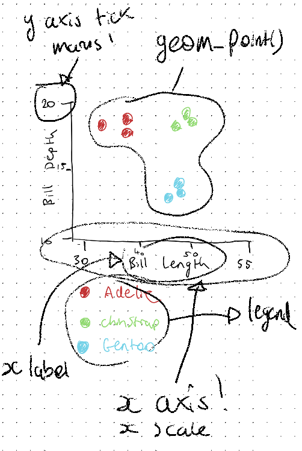
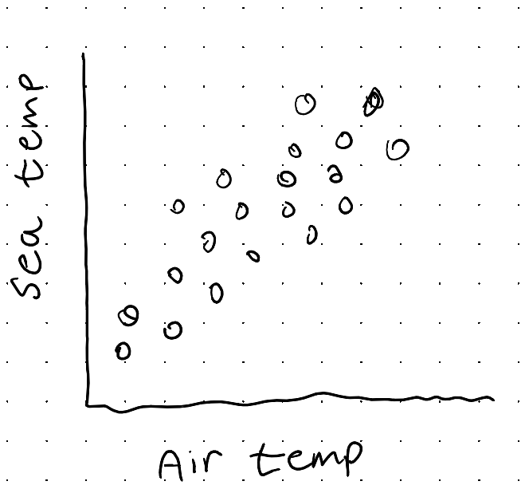
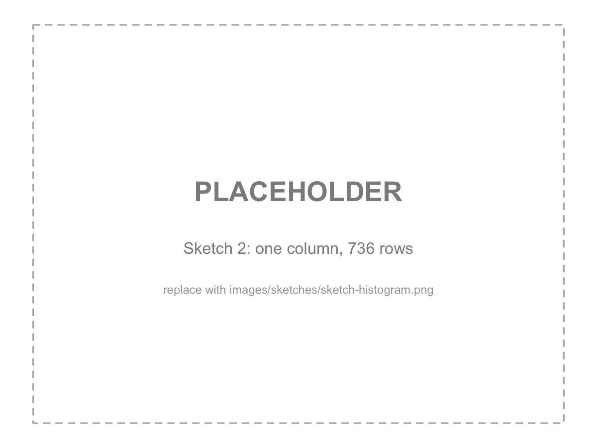

# Anatomy of a ggplot {#sec-anatomy}



You can get really far with ggplot2 by copying an example, changing the variable names, and a bit of use of an LLM.

One of the challenges with this, is that you might not have internalised the mental model of how ggplot plots are built. The system is rich, and built on a great foundation of theory that help you think about both how to build your data for data analysis, and how to then present it in a plot. 

This chapter is about the underlying features of ggplot2. We will take plots, tease them apart, and put them back together.

::: {.overview}

## Overview {.unnumbered}

**Duration** 45 minutes

**Questions**

<!-- These map onto the sections below, in order. If you move a section, move its question. -->

- What is this plot telling me, and what is it made of?
- What are the seven pieces of a ggplot?
- How do I build one up from nothing?
- How do I map a variable onto colour, shape, or size?
- Why does `colour` inside `aes()` do something different to `colour` outside it?
- How do I add a second layer?

**What you need this session**

- A session of RStudio open
- naniar package installed
- tidyverse package installed
- Something to draw on, and something to draw with

```{r}
#| label: setup
#| message: false
#| output: false
library(ggplot2)
library(naniar)
library(dplyr)
library(tidyr)
```

:::


## The data

We will be looking at some data from the `naniar` R package: `oceanbuoys` the helpfile tells us the following:

```r
?oceanbuoys
```

> Real-time data from moored ocean buoys for improved detection, understanding and prediction of El Ni'o and La Ni'a. The data is collected by the Tropical Atmosphere Ocean project (https://www.pmel.noaa.gov/gtmba/pmel-theme/pacific-ocean-tao).

Along with a list of the variables.

The data look like the following

```{r}
#| echo: false
 oceanbuoys |>
  head() |> 
  knitr::kable()
```

Each row represents recordings for a single oceanbuoy, recording:

 - the year it was taken
 - Latitude and longitude
 - temperature (sea temp and air temp, celcius)
 - humidity (relative humidity)
 - wind (east-west and north-south. Positive indicates blowing towards the former, negative the latter. E.g., positive values in `wind_ew` mean the wind is blowing towards the east, in metres per second).

## A nice enough plot

> Here's one I prepared earlier.

I've created a data visualisation of this data using ggplot2, let's look at it:

```{r}
#| label: fig-elnino
#| warning: false
#| fig-alt: |
#|   Scatterplot of sea temperature against air temperature. The points form
#|   two separate clusters. The 1993 readings sit between 22 and 25 degrees,
#|   and the 1997 readings sit between 26 and 30 degrees.

ggplot(
  oceanbuoys,
  aes(
    x = air_temp_c,
    y = sea_temp_c,
    colour = factor(year)
  )
) +
  geom_point(alpha = 0.6)
```

Each point is a reading from a buoy floating in the tropical Pacific. 

- The **X axis (horizontal)** is the air temperature
- the **Y axis (vertical)** is the temperature of the sea underneath it
- the **colour** is the year the reading was taken. 

Notice two clouds of data points.

1. One between 20-25C
2. One up between 26-29C

So what happened between 1993 and 1997? Let's take a look with dplyr:

```{r}
#| label: mean-temps
library(dplyr)
oceanbuoys |> 
  group_by(year) |> 
  summarise(
    mean_sea_temp_c = mean(sea_temp_c, na.rm = TRUE)
  )
```

It is a big jump - nearly five degrees celcius, in the same patch of ocean, four years apart. This is the result of
[El Niño](https://en.wikipedia.org/wiki/El_Ni%C3%B1o), and the 1997 to 1998
event was one of the strongest on record.

I think that is a lovely thing to be able to see in a plain scatterplot.

Notice now when we remove the colour, the story isn't as clear?

```{r}
#| label: fig-elnino-nocolour
#| warning: false
#| fig-alt: |
#|   The same scatterplot without colour. The points now read as one elongated
#|   cloud with a gap in the middle.
#| fig-cap: "The same readings, with the year removed."
ggplot(
  oceanbuoys,
  aes(
    x = air_temp_c,
    y = sea_temp_c
  )
) +
  geom_point(alpha = 0.6)
```

We still see this gap in the data, but we don't know it is related to year.

By mapping the variable "year" onto "colour", this was made clear.

A big question when showing data is to think:

> What is the right plot to use

Which is a good question.

But now I think we can also add to this:

> What do I want the plot to tell me? And what have I left out?

### What is it made of?

Let's take @fig-elnino a part.

Let's take another look at the code

1. We see **data**, `oceanbuoys`, which is from the {naniar} package.
2. There is a set of instructions saying which column goes where. `air_temp_c`
across, `sea_temp_c` up, `year` onto colour. Those live inside `aes()`.
3. And there is a `+` between them, which is how you glue the parts together.
4. There is something saying **draw a point for each row**: is `geom_point()`.

```{r}
library(naniar)
library(ggplot2)
ggplot(
  data = oceanbuoys,      # <1>
  aes(                    # <2>
    x = air_temp_c,       # <2>
    y = sea_temp_c,       # <2>
    color = factor(year)  # <2>
  )
) +                       # <3>
  geom_point(alpha = 0.6) # <4>
```


::: {.callout-note title="Your Turn"}

Look at @fig-elnino and answer these without running any code.

1. How many rows do you think `oceanbuoys` has? Have a guess, then check with
   `nrow(oceanbuoys)`.
2. If you mapped `humidity` onto the y axis instead of `sea_temp_c`,
   which part of the code would change?
3. If you wanted crosses instead of dots, which part would change?

:::

## Practice sketching your plots

I think this is almost always a useful exercise, but it is especially really useful when you are starting out with crafting data visualisations, and especially so with ggplot2.

Doing these kinds of sketches is something that [Nicola Rennie](https://nrennie.rbind.io/) promotes in her book, [The art of data visualisation with ggplot2](https://nrennie.rbind.io/art-of-viz/). It is free to read online, and is a great read, and goes into more advanced concepts than this book.

The sketches don't have to be perfect! They can just represent your intentions. I also find it really useful because it gets you to focus on how your graphic links back to your data.

It also reminds me of the feeling of asking a "good question" in research. Spend time thinking about a good question, and you'll do good work.

Have a vision of what you want to create, then you know what you want to work towards!

Let's practice doing some sketches of data based on a few snippets of data.

I'll show my drawings of a couple of these, and you can then practice on some other data.

### Sketching out data based on feel

Here are six rows of `oceanbuoys`, and two of its columns.

```{r}
#| label: sketch-scatter-data
#| echo: false
set.seed(2026-08-13)
oceanbuoys |>
  drop_na() |> 
  slice_sample(n = 6) |> 
  select(air_temp_c, sea_temp_c) |> 
  knitr::kable()
```

Have a look at those numbers before you read on. Where does each row go?

Here's what I do. I draw two axes and label them, air temperature across and
sea temperature up. Then having a look at the numbers, I just do a rough sketch of the kind of plot I want to draw.

{#fig-sketch-scatter fig-alt="A hand-drawn sketch of a scatterplot. Two axes are labelled, air temperature across the bottom and sea temperature up the side."}

It took about thirty seconds. I like it. It isn't the prettiest, but I know what I want to draw:

- air temperature on x axis
- sea temp on y axis
- one mark per row. 

That's data, aesthetics, and a geom.

The code says the same thing:

```{r}
#| label: fig-sketch-scatter-code
#| warning: false
#| fig-alt: |
#|   Scatterplot of sea temperature against air temperature, with all 736
#|   readings drawn as black points in two clusters.
#| fig-cap: "The same sketch, with all 736 rows instead of six."
ggplot(
  oceanbuoys,
  aes(
    x = air_temp_c,
    y = sea_temp_c
  )
) +
  geom_point()
```

I sketched the rows and ggplot2 drew all of them, so the plot is a lot denser. But the two clumps I drew are in the plot, and I found them by hand before I wrote a
line of code.

That's the bit I want you to notice.

### One column, and a lot of rows

Now a different snippet. One column this time.

```{r}
#| label: sketch-hist-data
#| echo: false
oceanbuoys |>
  slice(1:8) |>
  select(humidity) |>
  knitr::kable()
```

How would you draw this? What would you draw? What do you call this? You can't draw a scatterplot!

So the mark has to change. Instead of drawing each row, I draw the shape of
them, which means how many readings land in each slice of the range.

{#fig-sketch-histogram fig-alt="A hand-drawn sketch of a histogram. Humidity runs along the bottom axis from about 75 to about 80, count runs up the side, and a row of bars of uneven height sits on the axis forming a single hump."}

I don't know the heights. That's fine, I am not trying to know the heights.

Here's the plot:

```{r}
#| label: fig-sketch-hist-code
#| message: false
#| warning: false
#| fig-alt: |
#|   Histogram of humidity. The bars run from about 72 to about 95, with a
#|   single peak around 87 and a long tail to the left.
#| fig-cap: "Humidity for all 736 readings."
ggplot(
  oceanbuoys,
  aes(x = humidity)
) +
  geom_histogram()
```

My sketch got the mark right and the axis wrong.

The eight rows I looked at all sit between 75 and 80, so that's the range I
drew. The full data runs from 71.6 up to 94.8, and it piles up near 87, which
is off the end of my sketch entirely.

I like that this happened, and I have left the drawing as it was. A snippet tells
you what kind of plot you want. It does not tell you the range, and it will
happily mislead you about it if you let it.

::: {.callout-note title="Your Turn"}

Three snippets. Sketch each one before you write any code, then write the code
and see how close you got.

**1.** Sea temperature, and the latitude of the buoy that recorded it.

```{r}
#| label: turn-lat-data
#| echo: false
oceanbuoys |>
  slice(1, 150, 300, 420, 560, 700) |>
  select(latitude, sea_temp_c) |>
  knitr::kable()
```

**2.** The two wind columns, and the year.

```{r}
#| label: turn-wind-data
#| echo: false
oceanbuoys |>
  slice(1, 150, 300, 420, 560, 700) |>
  select(wind_ew, wind_ns, year) |>
  knitr::kable()
```

**3.** Four numeric columns, and you have two axes.

```{r}
#| label: turn-four-data
#| echo: false
oceanbuoys |>
  slice(1, 150, 300, 420, 560, 700) |>
  select(air_temp_c, sea_temp_c, humidity, wind_ew) |>
  knitr::kable()
```

Which two columns go on the axes, and what happens to the other two? There's no
right answer here. But whatever you leave out, you are deciding it doesn't
matter for the question you are asking, so it is worth knowing what the
question is.

:::

## The components of the grammar of graphics

The grammar of graphics is an idea from
[Leland Wilkinson](https://en.wikipedia.org/wiki/Leland_Wilkinson), and [ggplot2](https://ggplot2.tidyverse.org/)
is [Hadley Wickham](https://hadley.nz/)'s implementation of it. It is described as a grammar, in the sense that you can combine components together to express something complex.

There is more detail to the differences between Wilkinson's grammar of graphics, and the grammar implemented in ggplot2. If you want to learn more about the specific differences, the [ggplot2 book](https://ggplot2-book.org/) describes these, but I also would recommend reading the chapter in [Hadley Wickham's PhD thesis](http://had.co.nz/thesis/practical-tools-hadley-wickham.pdf), which provides other detail, too.

There are seven parts to the grammar of graphics as implemented in ggplot. I don't know them off by heart, and I don't expect you to. But they do provide a useful outline for the different features we will discuss in this course:

1. Data: Data frame you are plotting (@sec-shape)
2. Aesthetics: How columns map onto visual features (this chapter)
3. Geoms: The mark drawn (this chapter)
4. Stats: The computations that happen before drawing (@sec-compuated)
5. Scales: How data values change into different positions, and colours (@sec-computed)
6. Coords: The coordinate system that the marks (geom) are placed (@sec-computed)
7. Facets: How the plot is split into smaller subplots (@sec-comparing)

In this chapter we focus on: Data, aesthetics, and geoms.

We will come back to this table as we go in the course. But I find that knowing the names of these features of the plot provide useful features of a mental model to focus on and understand.

To give you a visceral sense of some of these features, I would like you to explore plotting another dataset. There are only 9 values, so you should be able to draw these. 

```{r}
#| echo: false
pen_short <- penguins |> 
        as_tibble() |> 
        select(species, year, bill_len, bill_dep) |> 
        drop_na() |> 
        group_by(species, year) |> 
        slice(1) |> 
        ungroup()

knitr::kable(pen_short)
```


::: {.callout-note title="Your Turn"}

Sketch!

Here's the data again:

```{r}
pen_short
```


I want you to draw a rough sketch of the penguins data, as a scatterplot:

- Bill Length (bill_len) on the x axis
- Bill Depth (bill_dep) on the y axis
- Each point should be coloured

Some things to consider as you draw:

- You can use symbols for the species if you don't have multiple colour options
  - How will you know which species is which (you will need a legend!)
- What should the range of the x axis be?
- What should the range of the y axis be?

Let's take 5 minutes to do this - I'll draw this too.

```{r}
#| echo: false
#| eval: !expr knitr::is_html_output()
library(countdown)
countdown(minutes = 5)
```

:::

Here's one I prepared earlier:

::: {.callout-note title="My plot" collapse="true"}

:::

Here's what ggplot2 does:

```{r}
library(ggplot2)
ggplot(pen_short,
       aes(x = bill_len,
           y = bill_dep,
           colour = species)) + 
        geom_point(size = 5)

```

(I totally fluked getting the colours the same)

::: {.callout-note title="Your Turn"}

- What did you notice about drawing your plot?
- Did you notice the extra steps for drawing a legend?
- The steps for determining the x and y axis?

There are many decisions you need to make when making a plot. I think ggplot really does a great job of breaking down those components in a way that make you think about the data, at the right level of detail.

:::

## Building a plot back up

We took a plot apart before. Let's build one up again.

Start with nothing but the data.

```{r}
#| label: fig-blank
#| fig-alt: A completely blank grey panel with no axes and no marks.
#| fig-cap: "Data, and nothing else."
ggplot(data = oceanbuoys)
```

This isn't super inspiring, but it is worth thinking about. I told ggplot2
what data to use, and absolutely nothing else. It does not know what to put on
the axes, and it does not know what to draw. It gives you a panel and waits.

Now let's say which columns go where, by specifying how they map onto an axes:

```{r}
#| label: fig-axes
#| fig-alt: |
#|   A grey panel with labelled axes for air temperature and sea temperature,
#|   but no points.
#| fig-cap: "Now with aesthetics. Axes appear, but nothing is drawn."
ggplot(
  data = oceanbuoys,
  mapping = aes(
    x = air_temp_c,
    y = sea_temp_c
  )
)
```

Now we get axes! These correspond to the range of the data. But we haven't said what data to put on there. We specify that with **A geom**.

```{r}
#| label: fig-points
#| warning: false
#| fig-alt: |
#|   The scatterplot with black points, forming one elongated cloud with a gap
#|   in the middle.
#| fig-cap: "And now a geom. This is a plot."
ggplot(
  oceanbuoys,
  aes(
    x = air_temp_c,
    y = sea_temp_c
  )
) +
  geom_point()
```

A plot!

Three lines, three pieces. Data, aesthetics, geom.

Let's show this as a set of panel tabs, to get a bit more of a sense of the plot being built up.


:::{.panel-tabset}

## grey

```{r}
ggplot(oceanbuoys)
```

## axes

```{r}
ggplot(
  oceanbuoys,
  aes(
    x = air_temp_c,
    y = sea_temp_c
  )
)
```

## geom

```{r}
ggplot(
  oceanbuoys,
  aes(
    x = air_temp_c,
    y = sea_temp_c
  )
) +
  geom_point()
```


:::

### A small (but worthwhile) digression into missing data

You might have noticed a warning:

```
Removed 81 rows containing missing values or values outside the scale range
```

That is no mistake! There are 81 readings in this data where the air
temperature was never recorded, and ggplot2 cannot draw a point when it does not
know where to put it, so it drops them and tells you.

This is a good thing, I think. For two reasons:

1. The fact it told you at all! Missing values are often omitted. It's nice ggplot2 is honest.

2. The plot you are looking at is __missing__ 81 readings, and nothing on the plot itself shows you that. You would have to read the warning.

I've spent a lot of time looking at missing data, and so I wrote two R packages to help explore data, and missing data: [{visdat}](https://docs.ropensci.org/visdat/), and [{naniar}](https://naniar.njtierney.com/).

A plot that I think is worthwhile showing is the `vis_miss()` plot from `{visdat}`:

```{r}
library(visdat)
vis_miss(oceanbuoys)
```

This shows the overall missingness in the dataset.

We come back to missing data properly in @sec-shape, where we draw those rows instead of throwing them away. For now, just know that they are missing.

### Colour

```{r}
#| label: fig-rebuilt
#| warning: false
#| fig-alt: |
#|   The scatterplot with points coloured by year, showing two separate
#|   clusters for 1993 and 1997.
#| fig-cap: "Mapping year onto colour. The gap becomes a story."
fig_ob_col <- ggplot(
  oceanbuoys,
  aes(
    x = air_temp_c,
    y = sea_temp_c,
    colour = factor(year)
  )
) +
  geom_point(alpha = 0.6)

fig_ob_col
```

I think it's pretty significant! You can change one aesthetic, and now you can tell a much clearer story: there is a difference in the years!

::: {.callout-note title="Your Turn"}

Build a plot up the same way, one piece at a time. Run each line before you add
the next, so you can see what each part contributes.

1. `ggplot(oceanbuoys)`
2. Add `aes(x = humidity, y = air_temp_c)`
3. Add `geom_point()`
4. Now add `colour = factor(year)` to the `aes()`

What does the year do to this plot? Is it as dramatic as it was for sea
temperature?

:::

## Mapping more variables

We have mapped x and y axis to data columns, and then demonstrated how colour changes the impact of the story.

There are more variables beyond "colour", such as "shape", and "size". 

To use these, you map a variable onto one the same way every time, inside `aes()`.

Let's try shape, instead of colour:

```{r}
#| label: fig-shape
#| warning: false
#| fig-alt: |
#|   Scatterplot where 1993 readings are circles and 1997 readings are
#|   triangles.
#| fig-cap: "Year mapped onto shape instead of colour."
fig_ob_shp <- ggplot(
  oceanbuoys,
  aes(
    x = air_temp_c,
    y = sea_temp_c,
    shape = factor(year)
  )
) +
  geom_point(alpha = 0.6)

fig_ob_shp
```

It works, and I think it is clearly worse than the colour version - see them side by side below to illustrate this:

```{r}
#| echo: false
library(patchwork)

(fig_ob_shp + theme_sub_legend(position ='top')) + (fig_ob_col+ theme_sub_legend(position ='top'))

```

The two groups are separated well enough here that you can still see the difference in shape, but you are now doing shape recognition instead of colour recognition. Humans are naturally much faster at identifying colour.

Now let's try size - we can map it onto the same "year" variable:

```{r}
#| label: fig-size-year
#| warning: false
#| fig-alt: |
#|   Scatterplot where point size varies with year.
#| fig-cap: "Year mapped onto size. This is not a good plot."
ggplot(
  oceanbuoys,
  aes(
    x = air_temp_c,
    y = sea_temp_c,
    size = year
  )
) +
  geom_point(alpha = 0.4)
```

While more obvious than shape, I do not thinkg this is a great usage of size. We can try mapping size to another variable, such as "humidity":

```{r}
#| label: fig-size
#| warning: false
#| fig-alt: |
#|   Scatterplot where point size varies with humidity, producing a cluttered
#|   overlapping mess.
#| fig-cap: "Humidity mapped onto size. This is not a good plot."
ggplot(
  oceanbuoys,
  aes(
    x = air_temp_c,
    y = sea_temp_c,
    size = humidity
  )
) +
  geom_point(alpha = 0.4)
```

Hmm? I don't love it. There is variation in size, but a lot of the points cover each other, and it is actually kind of hard to compare the sizes. I don't see a clear story, beyond the fact that air temperature and sea temperature are correlated.

So, while it is possible, mapping to aesthetics like **shape** and **size** aren't always the best choices.

We come back to this properly in @sec-eye, where we discuss choosing between different aesthetic mappings.

::: {.callout-note title="Your Turn"}

1. Using the `oceanbuoys` data, make a scatterplot in ggplot2 of `wind_ew` against `wind_ns`, coloured by year (as a factor).

```{r}
ggplot(oceanbuoys,
       aes(x = wind_ew,
           y = wind_ns,
           colour = factor(year))) +
  geom_point()
```

2. Now map `sea_temp_c` onto colour instead. What is different about the legend?

```{r}
ggplot(oceanbuoys,
       aes(x = wind_ew,
           y = wind_ns,
           colour = sea_temp_c)) +
  geom_point()
```

3. Try mapping `year` onto colour **without** wrapping it in `factor()`. What
   happens, and why do you think that is?

```{r}
ggplot(oceanbuoys,
       aes(x = wind_ew,
           y = wind_ns,
           colour = year)) +
  geom_point()
```


:::

## Using `aes` inside and outside

What to put inside and outside `aes()` ?

This is a common gotcha, it catches everybody, including me, sometimes.

If you want some nice "purple" points  - a reasonable request - you write might write:

```{r}
#| label: fig-bluebug
#| warning: false
#| fig-alt: |
#|   Scatterplot with salmon-coloured points and a legend titled "colour" with
#|   a single entry labelled "purple".
#| fig-cap: "Asking for purple Getting salmon, and a legend."
ggplot(
  oceanbuoys,
  aes(
    x = air_temp_c,
    y = sea_temp_c,
    colour = "purple"
  )
) +
  geom_point()
```

We now have a legend with an entry, "purple" - a bit strange, and unexpected?

So, what happened?

- Inside `aes()` are **mappings** to a variable in your data.
- "purple" is not a variable in the data.
- ggplot treated "purple" as a variable of a single category

The code above says:

> "take this variable and use it to decide the colour"

ggplot2 did exactly that. It took the value `"blue"`, and treated it as a variable with one single category, and gave that category the first colour from its default palette, which happens to be salmon.

If you want to **set** a colour rather than map one, it goes outside `aes()`,
in the geom.

```{r}
#| label: fig-bluefixed
#| warning: false
#| fig-alt: Scatterplot with purple points and no legend.
#| fig-cap: "Setting the colour instead of mapping it."
ggplot(
  oceanbuoys,
  aes(
    x = air_temp_c,
    y = sea_temp_c
  )
) +
  geom_point(colour = "purple")
```

Purple points, no legend.

::: {.callout-important title="This will bite you"}

The rule is short, and it is worth memorising.

> Inside `aes()` maps a variable. 
>
> Outside `aes()` sets a value.

Unexpected legends and colours can be clues for this kind of error!

:::

::: {.callout-note title="Your Turn"}

1. Make the points in your wind plot dark green and slightly transparent.
2. Now deliberately put `colour = "darkgreen"` inside `aes()` and look at what
   you get.
3. `size = 3` and `alpha = 0.5` follow exactly the same rule. Try setting each
   of them in both places.

:::

## Layers

The `+` is doing real work, and it's worth being explicit about what.

Each thing you add with `+` is a **layer**, and layers draw on top of each other
in the order you write them. So let's add a second one.

```{r}
#| label: fig-smooth
#| message: false
#| warning: false
#| fig-alt: |
#|   Scatterplot coloured by year with a separate fitted trend line running
#|   through each of the two clusters.
#| fig-cap: "Two layers. Points, then a smooth on top."
ggplot(
  oceanbuoys,
  aes(
    x = air_temp_c,
    y = sea_temp_c,
    colour = factor(year)
  )
) +
  geom_point(alpha = 0.4) +
  geom_smooth(method = "lm")
```

Two trend lines, one per year.

I never told `geom_smooth()` about the years. It inherited the whole `aes()`
from the `ggplot()` call, including the colour mapping, and a colour mapping
splits the data into groups. So it fitted one line per group.

That inheritance is the useful default most of the time. When you do not want
it, give the layer its own `aes()` and it will use that one instead.

```{r}
#| label: fig-smooth-override
#| message: false
#| warning: false
#| fig-alt: |
#|   The same scatterplot, but with a single black trend line running across
#|   both clusters instead of one line per year.
#| fig-cap: "Overriding the inherited mapping for one layer only."
ggplot(
  oceanbuoys,
  aes(
    x = air_temp_c,
    y = sea_temp_c
  )
) +
  geom_point(aes(colour = factor(year)), alpha = 0.4) +
  geom_smooth(method = "lm", colour = "black")
```

Now the colour mapping lives on the points, so the smooth doesn't see it, and
you get one line across everything.

Those two plots say quite different things, and the only difference is where the
`aes()` sits. Worth remembering when a smooth does something you didn't expect.

::: {.callout-note title="Your Turn"}

1. Add `geom_smooth()` to your humidity plot.
2. Swap the order of `geom_point()` and `geom_smooth()`. Can you see the
   difference? Look closely at where the lines and points overlap.
3. Try `geom_smooth(se = FALSE)`. What went away?

:::

## To summarise

Three things to take out of this chapter.

1. **A ggplot is data, aesthetics, and a geom, glued together with `+`.**
   Everything else is detail hanging off those three.
2. **Inside `aes()` maps a variable, outside `aes()` sets a value.** An
   unexpected legend means you mapped something by accident.
3. **The channels are not equal.** Position first, then colour, then shape, and
   size only when you have run out of better ideas.

And one habit, which is the one I actually care about.

When a plot surprises you, do not reach for a different example to copy. Ask
which of the seven pieces is doing something you did not ask it to do. Nearly
every ggplot2 problem I have ever had turned out to be one piece behaving
exactly as documented, in a way I had not thought about.

Next up is the shape of your data, which is where most of the remaining
surprises come from.


```{r}
#| echo: false
#| eval: false
# example nicer last plot
library(marquee)

# RColorBrewer::brewer.pal(name = "Dark2", n = 3) |> scales::show_col()
plot_cols <- RColorBrewer::brewer.pal(name = "Dark2", n = 3) |> 
  as.list() |>
  setNames(c("green", "orange", "purple"))

ggplot(
  oceanbuoys,
  aes(
    x = air_temp_c,
    y = sea_temp_c,
    colour = factor(year)
  )
) +
  geom_point(alpha = 0.6) +
  scale_colour_brewer(palette = "Dark2") +
  labs(
    title = "Sea and air temperature from buoys in the tropical Pacific",
    x = "Air Temp (C)",
    y = "Sea Temp (C)",
    colour = "Year"
  ) +
  annotate(
    x = 24.5,
    y = 22.5,
    geom = "text",
    colour = plot_cols$green,
    size = 15,
    label = "1997",
    size.unit = "pt"
  ) +
  annotate(
    x = 26.5,
    y = 29.5,
    geom = "text",
    colour = plot_cols$orange,
    size = 15,
    label = "1993",
    size.unit = "pt"
  ) +
  theme(legend.position = "none",
        aspect.ratio = 1/1.618)
```

