# Anatomy of a ggplot {#sec-anatomy}

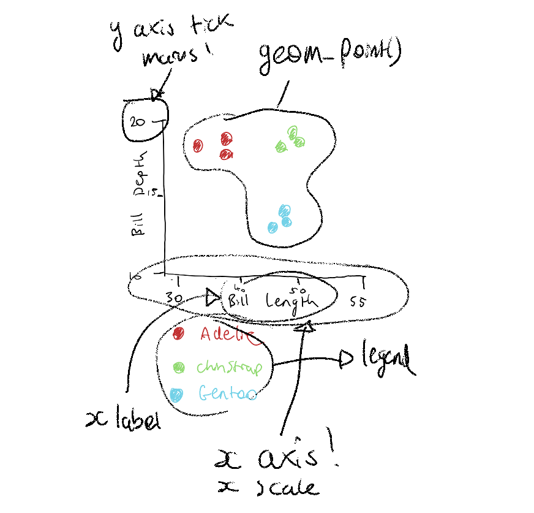

This chapter is about the underlying features of ggplot2. 

You can get really far with ggplot2 by copying an example, changing the variable names, and a bit of use of an LLM.

One of the challenges with this, is that you might not have internalised the mental model of how ggplot plots are built. The interface to ggplot2 helps you think about your data, build plots quickly for exploration, but also present finely made graphics.

In this chapter we will take plots, tease them apart, and put them back together.

> The greatest value of a picture is when it forces us to notice what we never
> expected to see.
>
> --- John Tukey

::: {.overview}

## Overview {.unnumbered}

**Duration** 45 minutes

**Questions**

<!-- These map onto the sections below, in order. If you move a section, move its question. -->

- What is this plot telling me, and what is it made of?
- What are the pieces of a ggplot?
- How do I build a plot up?
- How do I map a variable onto colour, shape, or size?
- Why does `colour` inside `aes()` do something different to `colour` outside it?
- How do I add a second layer?

**What you need this session**

- A session of RStudio open
- Something to draw on, and something to draw with
- The following packages installed

```{r}
#| label: setup
#| message: false
#| output: false
library(countdown)
library(ggplot2)
library(naniar)
library(dplyr)
library(tidyr)
```

:::

## Motivation {.unnumbered}

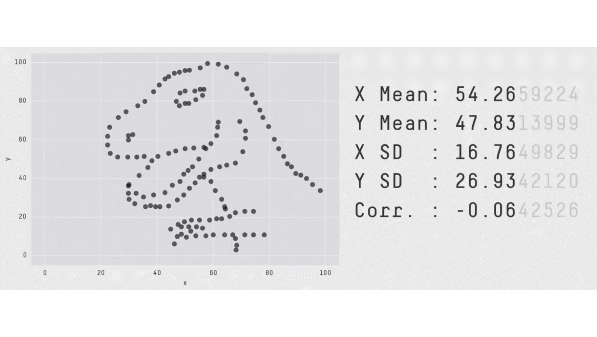{width=100%}


## The data

We will be looking at some data from the `naniar` R package: `oceanbuoys`. The helpfile tells us:

```r
?oceanbuoys
```

<!-- TODO: Have a drawing of the oceanbuoys, where they are in the map in the world. -->

> Real-time data from moored ocean buoys for improved detection, understanding and prediction of El Ni'o and La Ni'a. The data is collected by the Tropical Atmosphere Ocean project (https://www.pmel.noaa.gov/gtmba/pmel-theme/pacific-ocean-tao).

Along with a list of the variables.

The data look like the following

```{r}
#| echo: false
 oceanbuoys |>
  head() |> 
  knitr::kable()
```

Each row represents recordings for a single oceanbuoy:

 - The year it was taken
 - Latitude and longitude
 - Temperature (sea temp and air temp, celcius)
 - Humidity (relative humidity)
 - Wind (east-west and north-south).
 

## Practice sketching your plots

I think sketching out your plots is a really useful first step. Especially so when you are starting out with crafting data visualisations.

Doing these kinds of sketches is something that [Nicola Rennie](https://nrennie.rbind.io/) promotes in her book, [The art of data visualisation with ggplot2](https://nrennie.rbind.io/art-of-viz/). It is free to read online, and is a great read, and goes into more advanced concepts than this book.

The sketches don't have to be perfect! They can just represent your intentions for what you want to explore in the data. I find if I can draw the general shape of your plot, then it becomes easier to imagine other extensions. What is also particularly useful about this is that it doesn't require code. So, if you don't know how to code something up, your limitation is what  you can draw.

This is the standard of sketch I am wanting you to think about doing:

:::{.panel-tabset}

## Scatterplot

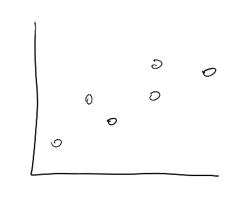

## Line plot

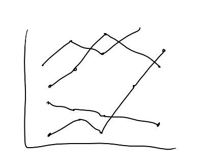

## barplot

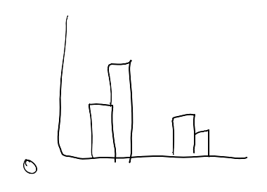

## boxplot

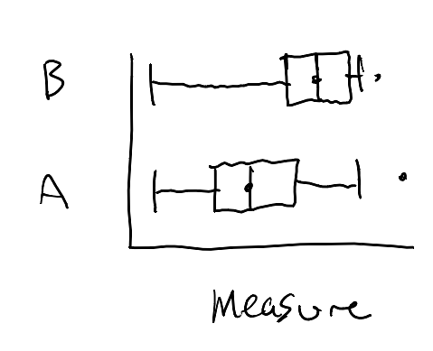

## facet/subplot

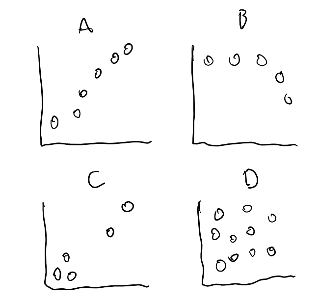


:::

Once you are comfortable identifying the parts you need to draw, it will be easier to link these back to a plotting system like ggplot2. Which, in turn forces you to think about how your data correspond to the plot.

It also reminds me of the feeling of asking a "good question" in research: Spend time thinking about a good question, and you'll do good work. 

Have a vision of what you want to create, then you know what you want to work towards!

Let's practice doing some sketches of data based on a few snippets of data.

I'll show my drawings of a couple of these, and you can then practice on some other data.


::: {.callout-note title="My sketching process"}

Here's what I do:

:::{.panel-tabset}

## Draw axis

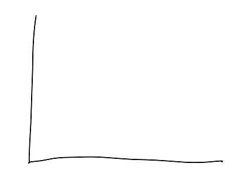

## Label axis

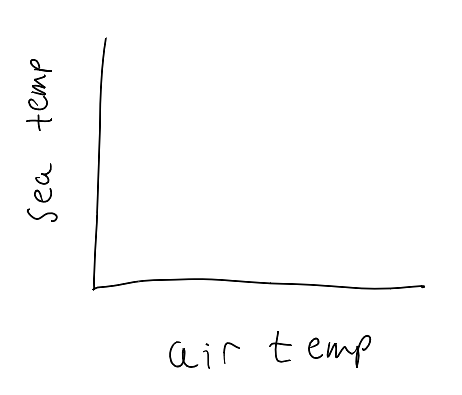

## Sketch the data

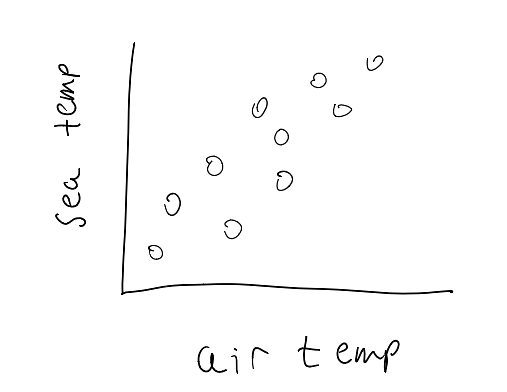

## Say it in a sentence

>  Plot the **oceanbuoys** data, mapping **air_temp_c** to the **x axis** and **sea_temp_c** to the **y axis**. Display using **points**.

:::

:::


::: {.callout-note title="Your Turn: Sketching plots"}

Here are 6 rows of `oceanbuoys`, and three of its columns.

```{r}
#| label: sketch-scatter-data
#| echo: false
set.seed(2026-08-13)
oceanbuoys |>
  drop_na() |> 
  group_by(year) |> 
  slice_sample(n = 3) |> 
  select(air_temp_c, sea_temp_c) |> 
  knitr::kable()
```

I want you to practice drawing this out as a scatterplot:

- For the `oceanbuoys` data
- air temp on the x axis
- sea temp on the y axis

```{r}
#| echo: false
#| eval: !expr knitr::is_html_output()
library(countdown)
countdown(minutes = 5)
```

:::

Sketching your data isn't the prettiest thing, but the point is that you practice visualising what is in your head, and putting it on the page.

There is something special about this. The better you are at putting these on the page, the easiest it will be to see them in your code. 

## Use ggplot2 to make a plot

> Here's one I prepared earlier.

I've created a data visualisation of this data using ggplot2:

```{r}
#| label: fig-elnino
#| warning: false
#| echo: false
#| fig-alt: |
#|   Scatterplot of sea temperature against air temperature. The points form
#|   two separate clusters.

ggplot(
  oceanbuoys,
  aes(
    x = air_temp_c,
    y = sea_temp_c
  )
) +
  geom_point()
```

Each point is a reading from a buoy floating in the tropical Pacific. 

- The **X axis (horizontal)** is the air temperature
- the **Y axis (vertical)** is the temperature of the sea underneath it

::: {.callout-note title="Your Turn: What do you see?"}

Take a couple of minutes to assess what you see in the plot above, and answer these questions:

1. How is the ggplot different to your sketch?
2. What do you see in the data - what is the story?
3. Is there something in here you would want to explore?

```{r}
#| echo: false
#| eval: !expr knitr::is_html_output()
library(countdown)
countdown(minutes = 2)
```


:::

## Creating plots in ggplot

OK, let's walk through how to create the plot using ggplot2. I like to use this template:

```
ggplot(data = <<DATA>>,
       mapping = aes(x = <<X AXIS VARIABLE>>,
           y = <<Y AXIS VARIABLE>>)) +
  geom_<<GEOM>>(<<OPTIONS>>)
```

Here is the code that produced the above plot, with that template:

```{r}
#| warning: false
ggplot(data = oceanbuoys,
       mapping = aes(x = air_temp_c,
           y = sea_temp_c)) + 
  geom_point()
```

### What is it made of?

Let's take another look at the code that creates @fig-elnino:

```{r}
library(naniar)
library(ggplot2)
ggplot(
  data = oceanbuoys,      # <1>
  mapping = aes(                    # <2>
    x = air_temp_c,       # <2>
    y = sea_temp_c,       # <2>
  )
) +                       # <3>
  geom_point() # <4>
```


1. We see **data**, `oceanbuoys`, which is from the {naniar} package.
2. There is a set of instructions **mapping** which column goes where - Those live inside `aes()`: `air_temp_c` across the x axis, `sea_temp_c` up the axis
3. There is a `+` between them, which is how you glue the parts together.
4. There is something saying **draw a point for each row**: is `geom_point()`.


## Building it back up


Three lines, three pieces. Data, aesthetics, geom.

Let's show this as a set of panel tabs, to get a bit more of a sense of the plot being built up.


:::{.panel-tabset}

## grey

```{r}
ggplot(oceanbuoys)
```

## axes

```{r}
ggplot(
  oceanbuoys,
  aes(
    x = air_temp_c,
    y = sea_temp_c
  )
)
```

## geom

```{r}
ggplot(
  oceanbuoys,
  aes(
    x = air_temp_c,
    y = sea_temp_c
  )
) +
  geom_point()
```

:::


::: {.callout-note title="Your Turn"}

Look at @fig-elnino and answer these without running any code.

1. How many rows do you think `oceanbuoys` has? Have a guess, then check with
   `nrow(oceanbuoys)`.
2. If you mapped `humidity` onto the y axis instead of `sea_temp_c`,
   which part of the code would change?
3. Using ggplot, can you draw this plot, with `humidity` on the y axis? See the above code for a template.


```{r}
#| echo: false
#| eval: !expr knitr::is_html_output()
library(countdown)
countdown(minutes = 3)
```


:::

::: {.callout-note title="Your Turn"}

Let's talk about adding colour - draw a scatterplot of this data:

```{r}
oceanbuoys |>
  drop_na() |> 
  group_by(year) |> 
  slice_sample(n = 3) |> 
  select(year, air_temp_c, sea_temp_c) |> 
  knitr::kable()
```

- Draw the axis
- air temp
- sea temp
- **Colour/shade the points by year**

```{r}
#| echo: false
#| eval: !expr knitr::is_html_output()
library(countdown)
countdown(minutes = 3)
```


:::

Here it is in ggplot:

```{r}
#| warning: false
#| echo: false
ggplot(oceanbuoys,
       aes(x = air_temp_c,
           y = sea_temp_c,
           colour = as.factor(year))) + 
  geom_point()
```

- What do you notice?
- How would you explore differences between years? 
- What would you search for?

```{r}
#| label: mean-temps
#| echo: false
library(dplyr)
ocean_sum <- oceanbuoys |> 
  group_by(year) |> 
  summarise(
    mean_sea_temp_c = mean(sea_temp_c, na.rm = TRUE)
  )
```

<!-- It is a big jump - nearly five degrees celcius! That is a lot - especially for it being in the same patch of ocean, four years apart. This is the result of -->
<!-- [El Niño](https://en.wikipedia.org/wiki/El_Ni%C3%B1o), and the 1997 to 1998 -->
<!-- event was one of the strongest on record. -->

<!-- This is a really interesting thing to be able to see in a plain scatterplot. -->


## The components of the grammar of graphics

The grammar of graphics is an idea from
[Leland Wilkinson](https://en.wikipedia.org/wiki/Leland_Wilkinson), and [ggplot2](https://ggplot2.tidyverse.org/)
is [Hadley Wickham](https://hadley.nz/)'s implementation of it. It is described as a grammar, in the sense that you can combine components together to express something complex.

There is more detail to the differences between Wilkinson's grammar of graphics, and the grammar implemented in ggplot2. If you want to learn more about the specific differences, the [ggplot2 book](https://ggplot2-book.org/) describes these, but I also would recommend reading the chapter in [Hadley Wickham's PhD thesis](http://had.co.nz/thesis/practical-tools-hadley-wickham.pdf), which provides other detail, too.

There are seven parts to the grammar of graphics as implemented in ggplot. I don't know them off by heart, and I don't expect you to. But they do provide a useful outline for the different features we will discuss in this course:

### **Data**: Data frame you are plotting 

```{r}
#| echo: false
oceanbuoys |> 
  head() |> 
  knitr::kable()
```

###  **Aesthetics**: How columns map onto visual features 

:::: {.columns}

::: {.column width="50%"}
```{r}
#| echo: true
#| eval: false
ggplot(oceanbuoys,
       aes(x = air_temp_c,
           y = sea_temp_c,
           colour = factor(year))) + 
  geom_point()
```

:::

:::{ .column width = "10%"}
:::

:::{ .column width = "40%"}
```{r}
#| echo: false
#| warning: false
ggplot(oceanbuoys,
       aes(x = air_temp_c,
           y = sea_temp_c,
           colour = factor(year))) + 
  geom_point()
```

:::

::::


###  **Geoms**: The mark drawn

```{r}
#| layout-ncol: 2
#| echo: false
#| warning: false
ggplot(oceanbuoys,
       aes(x = air_temp_c,
           y = sea_temp_c,
           colour = factor(year))) + 
  geom_point() + 
  geom_rug()

ggplot(oceanbuoys,
       aes(x = air_temp_c,
           y = sea_temp_c,
           colour = factor(year))) + 
  geom_line()
```


###  **Stats**: The computations that happen before drawing

```{r}
#| layout-ncol: 2
#| echo: false
#| warning: false
ggplot(oceanbuoys,
       aes(x = air_temp_c)) + 
  geom_histogram()

ggplot(oceanbuoys,
       aes(x = factor(year),
           y = sea_temp_c)) +
  geom_boxplot()
```

### **Scales**: How data values change into different positions, and colours 

```{r}
#| layout-ncol: 2
#| echo: false
#| warning: false
ggplot(oceanbuoys,
       aes(x = air_temp_c,
           y = humidity,
           colour = year)) + 
  geom_point() 

ggplot(oceanbuoys,
       aes(x = air_temp_c,
           y = humidity,
           colour = factor(year))) + 
  geom_point() +
  scale_colour_brewer(palette = "Dark2",
                      name = "Year")
```

### **Coords**: The coordinate system that the marks (geom) are placed 

```{r}
#| layout-ncol: 2
#| echo: false
#| warning: false
ggplot(oceanbuoys,
       aes(x = air_temp_c,
           y = humidity)) + 
  geom_point() 

ggplot(oceanbuoys,
       aes(x = air_temp_c,
           y = humidity)) + 
  geom_point() + 
  coord_polar()
```

::: {.callout-caution title="Some history: the most famous polar plot"}

`coord_polar()` looks like a novelty, and one of the most consequential
statistical graphics ever drawn is a polar bar chart.

Florence Nightingale is remembered as a nurse. She was also a statistician, and
during the Crimean War she drew what she called a coxcomb: a circle divided into
months, with the area of each wedge showing how many soldiers died, split by
cause. The picture made one thing impossible to miss, which is that far more men
were dying of preventable disease than of their wounds.

She was arguing for sanitary reform, and she reached for a plot because a table
would not have carried it. She was elected the first woman member of the Royal
Statistical Society.

A few years earlier, in 1854, John Snow mapped cholera deaths in Soho as marks
on a street map, and the marks clustered around one water pump on Broad Street.
Same move: put the data where the thing happened, and the pattern argues for
you.

If you want to follow the modern thread, Di Cook, Heike Hofmann and Debbie
Swayne have spent careers on how we read statistical graphics, and there is a
good starting point in [Di Cook's JSM
materials](https://github.com/dicook/JSM17).

:::

### **Facets**: How the plot is split into smaller subplots 

```{r}
#| layout-ncol: 2
#| echo: false
#| warning: false
ggplot(oceanbuoys,
       aes(x = air_temp_c,
           y = humidity)) + 
  geom_point() 

ggplot(oceanbuoys,
       aes(x = air_temp_c,
           y = humidity)) + 
  geom_point() + 
  facet_wrap(~year, ncol = 1)
```


In this chapter we focus on: **Data, aesthetics, and geoms.**

We will come back to these components as we go in the course. But I find knowing the names of these features of the plot provide useful features of a mental model to focus on and understand.

To give you a visceral sense of some of these features, I would like you to explore plotting another dataset. There are only 9 values, so you should be able to draw these. 

```{r}
#| echo: false
pen_short <- penguins |> 
        as_tibble() |> 
        select(species, year, bill_len, bill_dep) |> 
        drop_na() |> 
        group_by(species, year) |> 
        slice(1) |> 
        ungroup()

knitr::kable(pen_short)
```

::: {.callout-note title="Your Turn"}

Sketch!

Here's the data again:

```{r}
pen_short
```


I want you to draw a rough sketch of the penguins data, as a scatterplot:

- Bill Length (bill_len) on the x axis
- Bill Depth (bill_dep) on the y axis
- Each point should be coloured

Some things to consider as you draw:

- You can use symbols for the species if you don't have multiple colour options
  - How will you know which species is which (you will need a legend!)
- What should the range of the x axis be?
- What should the range of the y axis be?

Let's take 5 minutes to do this - I'll draw this too.

```{r}
#| echo: false
#| eval: !expr knitr::is_html_output()
library(countdown)
countdown(minutes = 5)
```

:::

Here's one I prepared earlier:

::: {.callout-note title="My plot" collapse="true"}
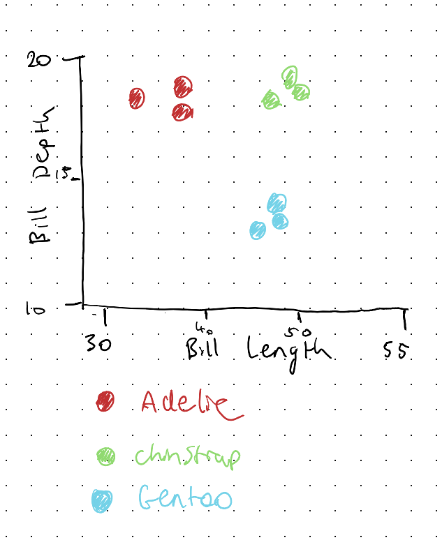
:::

Here's what ggplot2 does:

```{r}
library(ggplot2)
ggplot(pen_short,
       aes(x = bill_len,
           y = bill_dep,
           colour = species)) + 
        geom_point(size = 5)

```

::: {.callout-note title="Your Turn"}

- What did you notice about drawing your plot?
- Did you notice the extra steps for drawing a legend?
- The steps for determining the x and y axis?

```{r}
#| echo: false
#| eval: !expr knitr::is_html_output()
library(countdown)
countdown(minutes = 3)
```


There are many decisions you need to make when making a plot. I think ggplot really does a great job of breaking down those components in a way that make you think about the data, at the right level of detail.


:::

## Building the plot back up

Let's show the data and the plots alongside ach other again, so you can see the impact of colour:

:::{.panel-tabset}

## data

```{r}
#| label: fig-blank
#| fig-alt: A completely blank grey panel with no axes and no marks.
#| fig-cap: "Data, and nothing else."
ggplot(data = oceanbuoys)
```

## axes

```{r}
#| label: fig-axes
#| fig-alt: |
#|   A grey panel with labelled axes for air temperature and sea temperature,
#|   but no points.
#| fig-cap: "Now with aesthetics. Axes appear, but nothing is drawn."
ggplot(
  data = oceanbuoys,
  mapping = aes(
    x = air_temp_c,
    y = sea_temp_c
  )
)
```

## geom

```{r}
#| label: fig-points
#| warning: false
#| fig-alt: |
#|   The scatterplot with black points, forming one elongated cloud with a gap
#|   in the middle.
#| fig-cap: "And now a geom. This is a plot."
ggplot(
  oceanbuoys,
  aes(
    x = air_temp_c,
    y = sea_temp_c
  )
) +
  geom_point()
```

## colour

```{r}
#| label: fig-colour
#| warning: false
#| fig-alt: |
#|   The scatterplot with black points, forming one elongated cloud with a gap
#|   in the middle.
#| fig-cap: "And now a geom. This is a plot."
fig_ob_col <- ggplot(
  oceanbuoys,
  aes(
    x = air_temp_c,
    y = sea_temp_c,
    colour = year
  )
) +
  geom_point()

fig_ob_col
```

:::

:::{.callout-tip title="A digression into missing data" collapse="true"}

You might have noticed a warning in the recent plots:

```
Removed 81 rows containing missing values or values outside the scale range
```

That is no mistake! There are 81 readings in this data where the air
temperature was never recorded, and ggplot2 cannot draw a point when it does not
know where to put it, so it drops them and tells you.

This is a good thing, I think. For two reasons:

1. The fact it told you at all! Missing values are often omitted. It's nice ggplot2 is honest.

2. The plot you are looking at is __missing__ 81 readings, and nothing on the plot itself shows you that. You would have to read the warning.

I've spent a lot of time looking at missing data, and so I wrote two R packages to help explore data, and missing data: [{visdat}](https://docs.ropensci.org/visdat/), and [{naniar}](https://naniar.njtierney.com/).

A plot that I think is worthwhile showing is the `vis_miss()` plot from `{visdat}`:

```{r}
library(visdat)
vis_miss(oceanbuoys)
```

This shows the overall missingness in the dataset.

We come back to missing data properly later in the course, where we draw those rows instead of throwing them away. For now, just know that they are missing.

:::

## Mapping more variables

We have mapped x and y axis to data columns, and then demonstrated how colour changes the impact of the story.

There are more variables beyond "colour", such as "shape", and "size". 

To use these, you map a variable onto one the same way every time, inside `aes()`.

Let's try shape, instead of colour:

```{r}
#| label: fig-shape
#| warning: false
#| fig-alt: |
#|   Scatterplot where 1993 readings are circles and 1997 readings are
#|   triangles.
#| fig-cap: "Year mapped onto shape instead of colour."
fig_ob_shp <- ggplot(
  oceanbuoys,
  aes(
    x = air_temp_c,
    y = sea_temp_c,
    shape = factor(year)
  )
) +
  geom_point()

fig_ob_shp
```

It works, and I think it is clearly worse than the colour version - see them side by side below to illustrate this:

```{r}
#| echo: false
library(patchwork)

(fig_ob_shp + theme_sub_legend(position ='top')) + (fig_ob_col+ theme_sub_legend(position ='top'))

```

The two groups are separated well enough here that you can still see the difference in shape, but you are now doing shape recognition instead of colour recognition. Humans are naturally much faster at identifying colour.

Now let's try size - we can map it onto the same "year" variable:

```{r}
#| label: fig-size-year
#| warning: false
#| fig-alt: |
#|   Scatterplot where point size varies with year.
#| fig-cap: "Year mapped onto size. This is not a good plot."
ggplot(
  oceanbuoys,
  aes(
    x = air_temp_c,
    y = sea_temp_c,
    size = year
  )
) +
  geom_point()
```

While more obvious than shape, I do not thinkg this is a great usage of size. We can try mapping size to another variable, such as "humidity":

```{r}
#| label: fig-size
#| warning: false
#| fig-alt: |
#|   Scatterplot where point size varies with humidity, producing a cluttered
#|   overlapping mess.
#| fig-cap: "Humidity mapped onto size. This is not a good plot."
ggplot(
  oceanbuoys,
  aes(
    x = air_temp_c,
    y = sea_temp_c,
    size = humidity
  )
) +
  geom_point(alpha = 0.4)
```

Hmm? I don't love it. There is variation in size, but a lot of the points cover each other, and it is actually kind of hard to compare the sizes. I don't see a clear story, beyond the fact that air temperature and sea temperature are correlated.

So, while it is possible, mapping to aesthetics like **shape** and **size** aren't always the best choices.

We come back to this properly later in the course, where we discuss choosing between different aesthetic mappings.

::: {.callout-note title="Your Turn"}

1. Using the `oceanbuoys` data, make a scatterplot in ggplot2 of `wind_ew` against `wind_ns`, coloured by year (as a factor).

```{r}
ggplot(oceanbuoys,
       aes(x = wind_ew,
           y = wind_ns,
           colour = factor(year))) +
  geom_point()
```

2. Now map `sea_temp_c` onto colour instead. What is different about the legend?

```{r}
ggplot(oceanbuoys,
       aes(x = wind_ew,
           y = wind_ns,
           colour = sea_temp_c)) +
  geom_point()
```

3. Try mapping `year` onto colour **without** wrapping it in `factor()`. What
   happens, and why do you think that is?

```{r}
ggplot(oceanbuoys,
       aes(x = wind_ew,
           y = wind_ns,
           colour = year)) +
  geom_point()
```


```{r}
#| echo: false
#| eval: !expr knitr::is_html_output()
library(countdown)
countdown(minutes = 5)
```


:::

## Using `aes` inside and outside

What to put inside and outside `aes()` ?

This is a common gotcha, it catches everybody, including me, sometimes.

If you want some nice "purple" points  - a reasonable request - you write might write:

```{r}
#| label: fig-bluebug
#| warning: false
#| fig-alt: |
#|   Scatterplot with salmon-coloured points and a legend titled "colour" with
#|   a single entry labelled "purple".
#| fig-cap: "Asking for purple Getting salmon, and a legend."
ggplot(
  oceanbuoys,
  aes(
    x = air_temp_c,
    y = sea_temp_c,
    colour = "purple"
  )
) +
  geom_point()
```

We now have a legend with an entry, "purple" - a bit strange, and unexpected?

So, what happened?

- Inside `aes()` are **mappings** to a variable in your data.
- "purple" is not a variable in the data.
- ggplot treated "purple" as a variable of a single category

The code above says:

> "take this variable and use it to decide the colour"

ggplot2 did exactly that. It took the value `"blue"`, and treated it as a variable with one single category, and gave that category the first colour from its default palette, which happens to be salmon.

If you want to **set** a colour rather than map one, it goes outside `aes()`,
in the geom.

```{r}
#| label: fig-bluefixed
#| warning: false
#| fig-alt: Scatterplot with purple points and no legend.
#| fig-cap: "Setting the colour instead of mapping it."
ggplot(
  oceanbuoys,
  aes(
    x = air_temp_c,
    y = sea_temp_c
  )
) +
  geom_point(colour = "purple")
```

Purple points, no legend.

::: {.callout-important title="This will bite you"}

The rule is short, and it is worth memorising.

> Inside `aes()` maps a variable. 
>
> Outside `aes()` sets a value.

Unexpected legends and colours can be clues for this kind of error!

:::

::: {.callout-note title="Your Turn"}

1. Make the points in your wind plot dark green and slightly transparent.
2. Now deliberately put `colour = "darkgreen"` inside `aes()` and look at what
   you get.
3. `size = 3` and `alpha = 0.5` follow exactly the same rule. Try setting each
   of them in both places.

```{r}
#| echo: false
#| eval: !expr knitr::is_html_output()
library(countdown)
countdown(minutes = 5)
```


:::

## Layers

The `+` is doing a lot! It is worth being explicit about what.

Each thing you add with `+` is a **layer**, and layers draw on top of each other
in the order you write them. So let's add a second one.

```{r}
#| label: fig-smooth
#| message: false
#| warning: false
#| fig-alt: |
#|   Scatterplot coloured by year with a separate fitted trend line running
#|   through each of the two clusters.
#| fig-cap: "Two layers. Points, then a smooth on top."
ggplot(
  oceanbuoys,
  aes(
    x = air_temp_c,
    y = sea_temp_c,
    colour = factor(year)
  )
) +
  geom_point(alpha = 0.4) +
  geom_smooth(method = "lm")
```

Two trend lines, one per year.

I never told `geom_smooth()` about the years. It inherited the whole `aes()`
from the `ggplot()` call, including the colour mapping, and a colour mapping
splits the data into groups. So it fitted one line per group.

That inheritance is the useful default most of the time. When you do not want
it, give the layer its own `aes()` and it will use that one instead.

```{r}
#| label: fig-smooth-override
#| message: false
#| warning: false
#| fig-alt: |
#|   The same scatterplot, but with a single black trend line running across
#|   both clusters instead of one line per year.
#| fig-cap: "Overriding the inherited mapping for one layer only."
ggplot(
  oceanbuoys,
  aes(
    x = air_temp_c,
    y = sea_temp_c
  )
) +
  geom_point(aes(colour = factor(year)), alpha = 0.4) +
  geom_smooth(method = "lm", colour = "black")
```

Now the colour mapping lives on the points, so the smooth doesn't see it, and
you get one line across everything.

Those two plots say quite different things, and the only difference is where the
`aes()` sits. Worth remembering when a smooth does something you didn't expect.

::: {.callout-note title="Your Turn"}

1. Add `geom_smooth()` to your humidity plot.
2. Swap the order of `geom_point()` and `geom_smooth()`. Can you see the
   difference? Look closely at where the lines and points overlap.
3. Try `geom_smooth(se = FALSE)`. What went away?

```{r}
#| echo: false
#| eval: !expr knitr::is_html_output()
library(countdown)
countdown(minutes = 5)
```


:::

## When it doesn't work

You are going to hit errors, and most of them in ggplot2 are one of a small
number of things. This is the list I actually run through.

**Count your brackets and quotes.** `aes(x = hour, y = mean_count` will not
run, and neither will `colour = "purple`. Note that `'` and `"` are different
characters, and they have to match each other.

**Look for a `+` in the console.** If R is showing you a `+` instead of a `>`,
it is still waiting for you to finish something. Press ESCAPE and start again.

**Check where your `+` signs are.** In ggplot2 the `+` goes at the **end** of a
line, never the start. This works:

```r
ggplot(oceanbuoys, aes(x = air_temp_c, y = sea_temp_c)) +
  geom_point()
```

and this quietly does not:

```r
ggplot(oceanbuoys, aes(x = air_temp_c, y = sea_temp_c))
  + geom_point()
```

The second one runs the `ggplot()` call on its own, draws a blank panel, and
then hits the `+` as a separate statement:

```
Error: Cannot use `+` with a single argument.
```

Which is true, and gives you no clue that the actual problem is a line break.

**Copy the error message and search it.** All of it, not your description of it.
Somebody has had it before.

::: {.callout-tip title="Read more"}

The [ggplot2 cheatsheet](https://opensource.posit.co/resources/cheatsheets/) is two pages
of every geom, scale and theme, laid out visually. It is genuinely the fastest
way to find the geom you half remember.

There is also the [ggplot2 extension
gallery](https://exts.ggplot2.tidyverse.org/gallery/) for when base ggplot2 does
not have the thing you want.

:::

::: {.callout-tip title="Polish" collapse="true"}

The el Niño scatter has been bare the whole chapter, which was the point: seven
pieces and nothing else. Here it is with a few more of them turned on.

```{r}
#| label: fig-polish
#| warning: false
#| fig-alt: |
#|   The sea against air temperature scatter, coloured by year, which separates
#|   the two clusters.
ggplot(oceanbuoys,
       aes(x = air_temp_c,
           y = sea_temp_c,
           colour = factor(year))) +
  geom_point(alpha = 0.5) +
  labs(x = "Air temperature (°C)",
       y = "Sea temperature (°C)",
       colour = NULL) +
  theme_minimal() +
  theme(legend.position = "top")
```

- `colour = factor(year)` names the two clumps. They were 1993 and 1997 all
  along, and the plot never said so.
- `alpha = 0.5` because the points overlap, and where they pile up is
  information.
- Units in the axis labels, so nobody has to ask.
- `colour = NULL` drops a legend title that only repeated what the values say.

:::

## To summarise

Three things to take out of this chapter.

1. **A ggplot is data, aesthetics, and a geom, glued together with `+`.**
   Everything else is detail hanging off those three.
2. **Inside `aes()` maps a variable, outside `aes()` sets a value.** An
   unexpected legend means you mapped something by accident.
3. **The channels are not equal.** Position first, then colour, then shape, and
   size only when you have run out of better ideas.

And one habit, which is the one I actually care about.

When a plot surprises you, do not reach for a different example to copy. Ask
which of the seven pieces is doing something you did not ask it to do. Nearly
every ggplot2 problem I have ever had turned out to be one piece behaving
exactly as documented, in a way I had not thought about.

Next up is tidy data, which is where most of the remaining
surprises come from.


