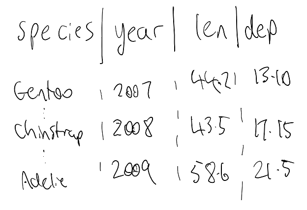

# The shape of your data {#sec-shape}

<!-- Claude: "shape" is the wrong word here - it should be "tidy data" - the key is "tidy". Make sure to update other references to "shape" here. -->

In my experience, a lot of my ggplot problems were actually problems with my 
data, and how I had it formatted. I found this was especially so early on, when 
I was learning how to use ggplot.

I believe these data problems are somewhat solved by making sure your data 
is in a format called "tidy data". We will talk about what that means, and 
how to spot data that isn't "tidy", and fix it.

We also come back to those missing observations in the oceanbuoys data we look at in @sec-anatomy.

::: {.overview}

## Overview {.unnumbered}

**Duration** 40 minutes

**Questions**

<!-- These map onto the sections below, in order. If you move a section, move its question. -->

- What does ggplot2 expect my data to look like?
- How do I make sure the data given is indeed "tidy data"?
- Why did my line graph come out as a scribble?
- What happened to the rows with missing values?


**What you need this session**

- A session of RStudio open
- Something to draw on, and something to draw with
- The following packages installed


```{r}
#| label: pkgs
#| output: false
library(dplyr)
library(tidyr)
library(naniar)
library(visdat)
```

```{r}
#| label: pkgs-extra
#| output: false
library(countdown)
```


:::


## What ggplot2 expects: Tidy Data

The `ggplot2` package expects data in a specific format, called "Tidy Data".

Tidy data is three rules:

1. Every variable has its own column
2. Every observation has its own row
3. Every value has its own cell

I find it easier to check those rules by writing them down or filling in the blanks, something like:

> - The variables in the data are: ___
> - Each row (observation) represents: ___
> - Each cell (value) contains: ___

For `pen_short`, that gives us:

> - **The variables in the data are:** species, year, bill_len, bill_dep
> - **Each row (observation) represents:** one penguin, measured in that year
> - **Each cell (value) contains:** a single value

This is a similar to what we did in @sec-anatomy, but in the other direction. There
we said the plot in a sentence before we drew it. Here we say the data in a
sentence before we plot it.

If I'm having a hard time working out what the data should look like, I'll even sketch a table:



As you get more comfortable with R, you can even start to create what the data should look like as a data.frame from scratch - saying out aloud: 

> - our variables are...
> - each row contains ...
> - each cell contains...

```{r}
example <- data.frame(
  species = c("gentoo", "chinstrap", "adelie"),
  year = c(2007, 2008, 2009),
  bill_len = c(44.2, 43.5, 58.6),
  bill_dep = c(13.1,17.15, 21.5)
)

example
```

I find using `tibble::tribble()` can be nice for this, as the data format is more human-readable. It doesn't scale super well for hand writing out data, though:

:::{.panel-tabset}

## data.frame / tibble

```{r}
tibble(
  species = c("gentoo", "chinstrap", "adelie"),
  year = c(2007, 2008, 2009),
  bill_len = c(44.2, 43.5, 58.6),
  bill_dep = c(13.1,17.15, 21.5)
)
```


## tibble::tribble

```{r}
tibble::tribble(
  ~species,     ~year, ~bill_len, ~bill_dep,
   "gentoo",    2007,   44.2,      13.1,
   "chinstrap", 2008,   43.5,      17.15,
   "adelie",     2009,   58.6,      21.5
)
```


:::


If you can sketch the plot you want, you can work backwards to the data you need.

These are the benefits of tidy data, and ggplot: your data links to the plot, and the plot links to the data.

Your sketch has air temp on one axis and sea temp on the other: 
 - those are two variables, so those are two columns.

And if you can't fill in the blanks, it might be a sign your data isn't tidy yet.

Let's explore this by breaking each of the rules. We will look again at the `pen_short` data:

```{r}
#| echo: false
pen_short <- penguins |> 
        as_tibble() |> 
        select(species, year, bill_len, bill_dep) |> 
        drop_na() |> 
        group_by(species, year) |> 
        slice(1) |> 
        ungroup()
```

This is the data in **tidy data form**

```{r}
pen_short
```

Think back to the plot of `pen_short` that we had in the previous chapter:

```{r}
library(ggplot2)
ggplot(pen_short,
       aes(x = bill_len,
           y = bill_dep,
           colour = species)) + 
        geom_point(size = 5)
```

Notice how each of the columns map onto an argument inside `aes()` ?

Here it is as messy - notice the variables don't form columns - they are in the rows:

```{r}
#| echo: false
pen_long_bill <- pen_short |> 
        pivot_longer(
                cols = c(bill_len, bill_dep),
                names_to = "bill_variable",
                values_to = "measurement"
        )
pen_long_bill
```

Here it is as another flavour of messy - each individual cell contains two values:

```{r}
#| echo: false
pen_two_val <- pen_short |> 
        mutate(bill_ratio = paste0(bill_len,"/",bill_dep)) |> 
        select(-bill_len,
               -bill_dep)

pen_two_val
```

And yet another messy - this time the year variable is for each column. These each contain measurements of bill depth, and bill length, respectively:

```{r}
#| echo: false
# bill_dep
pen_year_bill_dep <- pen_short |> 
        select(-bill_len) |> 
        pivot_wider(
                names_from = year,
                values_from = bill_dep
        )

pen_year_bill_dep

# bill_len
pen_year_bill_len <- pen_short |> 
        select(-bill_dep) |> 
        pivot_wider(
                names_from = year,
                values_from = bill_len
        )

pen_year_bill_len
```

Now let's go back to the tidy data of penguins:

```{r}
pen_short
```

And go back again to our ggplot:

```{r}
library(ggplot2)
ggplot(pen_short,
       aes(x = bill_len,
           y = bill_dep,
           colour = species)) + 
        geom_point(size = 5)
```

Before, each of the columns map onto an argument inside `aes()`.

Now, think about how to do this for a messy dataset:

```{r}
pen_long_bill
```

How can we plot "bill depth vs bill length"?

And when there are two values in each cell, how do we plot those?

```{r}
pen_two_val
```

And for the separate years? What do we call these?

```{r}
pen_year_bill_len
```

I'm not saying you can't plot data from this data. I am saying it is hard to do it. It doesn't fit into the tool usage.

But when the data is in a standard, "Tidy" form, then this becomes much easier:

```{r}
pen_short
```


I am not sure if I can overstate the impact of the concept of "Tidy Data" on
the R programming world, and statistics in general. 

## Making data tidy

::: {.callout-tip title="The code that made those messy datasets" collapse="true"}

I kept the code above hidden so the messy data lands on its own, without
`pivot_longer()` and `pivot_wider()` giving away the ending.

From here on we run code against those objects, so you need them in your own
session. Run this and you will have all four.

```{r}
#| eval: false
pen_short <- penguins |>
  as_tibble() |>
  select(species, year, bill_len, bill_dep) |>
  drop_na() |>
  group_by(species, year) |>
  slice(1) |>
  ungroup()

# variables sitting in the rows instead of forming columns
pen_long_bill <- pen_short |>
  pivot_longer(
    cols = c(bill_len, bill_dep),
    names_to = "bill_variable",
    values_to = "measurement"
  )

# two values jammed into one cell
pen_two_val <- pen_short |>
  mutate(bill_ratio = paste0(bill_len, "/", bill_dep)) |>
  select(-bill_len, -bill_dep)

# year spread across the column names
pen_year_bill_dep <- pen_short |>
  select(-bill_len) |>
  pivot_wider(names_from = year, values_from = bill_dep)

pen_year_bill_len <- pen_short |>
  select(-bill_dep) |>
  pivot_wider(names_from = year, values_from = bill_len)
```

If any of that is unfamiliar, that is fine. It is the rest of this section.

:::

To make this a bit easier to learn, we have our reference set of tidy data, that each of these will convert back to:

```{r}
pen_short
```

To do the data tidying, we will be looking at two functions:

1. `pivot_wider()`: To make our data have more columns, and fewer rows
2. `pivot_longer()`: To make our data have fewer columns, and more rows.

The problem with `pen_long_bill` here is that all the "bill" related variables are in a single column. 

```{r}
pen_long_bill
```

We want to have one variable per column, so we want: "bill_variable" and "measurement" turned into two variables:

- "bill_len"
- "bill_dep"

Where their observations form rows - the values of bill length, and bill depth, respectively.

To make this happen we use `pivot_wider()`, and use the `names_from` and `values_from` arguments:

```{r}
pen_long_bill |> 
        pivot_wider(
                names_from = bill_variable,
                values_from = measurement
        )
```

- `names_from`: Here we want to create more columns, to make them wider, and we want the **names** of those columns to come **from** `bill_variable`
- `values_from`: We need the **values** for our new columns to come **from** `measurement` 

The way I internalise this when I am using the `pivot_wider()` or `pivot_longer()` functions, is to always think of:

- Names: What are my tidy columns
- Values: What are my values


::: {.callout-note title="Your Turn"}

```{r}
#| echo: false
#| eval: !expr knitr::is_html_output()
library(countdown)
countdown(minutes = 5)
```

Run the code below to create the `hi_score` dataset:

```{r}
hi_score <- tibble::tribble(
  ~score, ~variable, ~values,
  11000,  "game",    "pacman",
  11000,  "person",  "James",
  9100,   "game",    "asteroids",
  9100,   "person",  "James",
  18000,  "game",    "pacman",
  18000,  "person",  "Sarida",
  1200,   "game",    "asteroids",
  1200,   "person",  "Sarida",
)

hi_score
```

Now, tidy this using `pivot_wider()`

<details>
<summary>Answer code below</summary>

<details>
<summary>Only really click on this if you've actually had a go at doing it!</summary>

```{r}
hi_score |> 
        pivot_wider(
                names_from = variable,
                values_from = values
        ) |> 
        # use dplyr::relocate
        relocate(
                person, game, score
        )
```

</details>

</details>

Now try using `pivot_wider()` with a different dataset: `fish_encounters` - which contains (type `?fish_encounters` to get details) information about fish swimming down a river.

```{r}
fish_encounters
```

Tidy this using `pivot_wider()`:

<details>
<summary>Answer code below</summary>

<details>
<summary>Only really click on this if you've actually had a go at doing it!</summary>

```{r}
fish_encounters |> 
        pivot_wider(
                names_from = station,
                values_from = seen
        )
```


</details>
</details>

What do you notice about this data? If there are missing values, should we do something about them? See the argument `values_fill` for options here.

<details>
<summary>Answer code below</summary>

```{r}
fish_encounters |> 
        pivot_wider(
                names_from = station,
                values_from = seen,
                values_fill = 0
        )
```

</details>

:::

## Using `pivot_longer()`

Let's look at using `pivot_longer()` with `pen_year_bill_dep`

```{r}
pen_year_bill_dep
```

Similar to `pivot_wider()`, there `name` and `value` arguments - this time, we have `names_to`, `values_to`, and `cols`:


```{r}
pen_year_bill_dep |> 
        pivot_longer(
                cols = c(`2007`, `2008`, `2009`),
                names_to = "year",
                values_to = "bill_dep"
        )
```

- `cols`: We use `cols` as we need to tell `pivot_longer()` which columns to be acting on. We didn't need to do that with `pivot_wider()` as we told it already which columns were being acted on. Note that we need to wrap the years in back ticks (``), as they start with numbers. See below for a workaround.
- `names_to`: We specify "years" in quotes as this is the name of the column we are creating
- `values_to`: we specify "bill_dep"

It is worth explaining some workarounds for `cols` - you don't always want to be specifying every single column name.  We can be a little bit crafty and use `-species`, which says: every column but species.

```{r}
pen_year_bill_dep |> 
        pivot_longer(
                cols = -species,
                names_to = "year",
                values_to = "bill_dep"
        )
```

We can also do `` `2007`:`2009` `` to indicate all columns between 2007 and 2009. 

```{r}
pen_year_bill_dep |> 
        pivot_longer(
                cols = `2007`:`2009`,
                names_to = "year",
                values_to = "bill_dep"
        )
```

Note that you cannot do this with just the bare numbers, as it will assume you are referring to column positions by number, not name:

```{r}
#| error: true
pen_year_bill_dep |> 
        pivot_longer(
                cols = c(2007, 2008, 2009),
                names_to = "year",
                values_to = "bill_dep"
        )
```

See `help("tidyr_tidy_select")` for more information on specifying column names.

::: {.callout-note title="Your Turn"}

```{r}
#| echo: false
#| eval: !expr knitr::is_html_output()
countdown(minutes = 5)
```

Now try using `pivot_longer()` with a different dataset: `relig_income`, which comes bundled inside `tidyr`. This is a dataset that contains religion and income ranges.

```{r}
relig_income
```

:::

## Separating columns to make them tidy

When values are combined together, you can use the `separate_wider_delim()` function to separate them out: 

```{r}
pen_two_val |> 
        separate_wider_delim(
                cols = bill_ratio,
                delim = "/",
                names = c("bill_dep", "bill_len")
                )

```


::: {.callout-note title="Your Turn"}


```{r}
#| echo: false
#| eval: !expr knitr::is_html_output()
countdown(minutes = 5)
```

Now try with this data:

```{r}
dat_fish <- tibble(
  id = c("handfish", "rainbow trout", "galaxiids"),
  values = c("m-3", "f-1100", "m-300")
)

dat_fish
```


:::

<!-- The same pedestrian data with the four sensors as four columns, which is
     exactly how it arrives from anyone's Excel file. pivot_longer() to fix it,
     pivot_wider() as the way back. -->


## The scribble aka "sawtoothing"

<!-- Uses pen_short rather than the pedestrian sensors: it is already in the
     chapter, it needs no extra package, and at 9 rows a reader can trace the
     path by hand and see exactly why it zigzags. -->

Here's a plot I have made by accident more times than I would like to admit.^[I wrote a blog post about this one: <https://www.njtierney.com/posts/2020-06-14-jq-sawtooth/>]

We have bill length, measured over three years, for three species. So let's
draw a line.

```{r}
pen_short <- penguins |> 
        as_tibble() |> 
        select(species, year, bill_len, bill_dep) |> 
        drop_na() |> 
        group_by(species, year) |> 
        slice(1) |> 
        ungroup()

pen_short
```


```{r}
#| label: fig-scribble
#| fig-alt: |
#|   A line plot of bill length against year. Instead of three separate lines
#|   there is a single line zigzagging steeply up and down between every point.
ggplot(pen_short,
       aes(x = year,
           y = bill_len)) +
  geom_line()
```

That is one line - a bit messy!

`geom_line()` connects the points in the order it meets them. It has no idea
that a species is a thing, so it joins Adelie to Chinstrap to Gentoo and then
jumps back down to the next year.

`group = species` tells it where one line stops and the next one starts.
`colour = species` does the same job, and also tells the reader which line is
which, which is why I nearly always reach for `colour` instead.

This is the same behaviour we saw in @sec-anatomy, where a colour mapping split
`geom_smooth()` into one line per year. A colour mapping implies a grouping.

::: {.callout-note title="Your Turn"}

1. Look at `pen_short` again and trace the line with your finger, in the order
   the rows appear. Why does it zigzag?

```{r}
pen_short
```

2. Add `group = species` inside `aes()`. What happened?

3. Now use `colour = species` instead of `group = species`. What did that fix
   that `group` didn't?

4. Which of those two would you use, and when?

:::

## Missing Data

<!-- Back to oceanbuoys and the `Removed 81 rows` warning from @sec-anatomy.
     vis_miss() and geom_miss_point(), which draws the dropped rows instead of
     discarding them.

     It belongs in this chapter because missingness is a property of the data
     you have, not of what the plot computes. And the payoff lands on the same
     data that raised the question.

     Prose still to write. The Your Turn below stands on its own in the
     meantime, and is the shape the section will take. -->

::: {.callout-note title="Your Turn"}

Back in @sec-anatomy, ggplot2 told us it had dropped 81 rows.

1. Run `vis_miss(oceanbuoys)`. Which variables are missing, and how much?

2. Now swap `geom_point()` for `geom_miss_point()` on the air temperature and
   sea temperature scatterplot. Where do the dropped rows go?

3. Does seeing them change what you think the plot says?

:::
