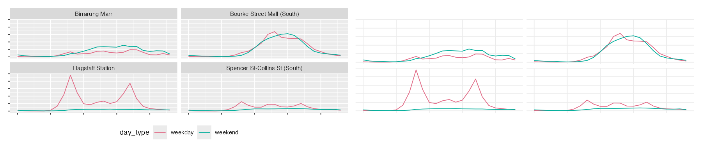

# Clutter and overplotting {#sec-clutter}



Once you've got the message clear in your plot, there can still be some clutter in the graphic. 

To structure how to clean up your plot, we will talk about 

- Decoration
- density, and
- summary


::: {.overview}

## Overview {.unnumbered}

**Duration** 49 minutes

**Questions**

<!-- These map onto the sections below, in order. If you move a section, move its question. -->

- How much of this plot is not data?
- What do I do when there are too many points to see anything?
- What is my summary hiding?

**What you need this session**

- A session of RStudio open
- Something to draw on, and something to draw with
- The following packages installed

```{r}
#| label: pkgs
#| message: false
#| output: false
library(tidyverse)
library(naniar)
library(gghighlight)
library(ggridges)
library(ggrain)
```

```{r}
#| label: pkgs-extra
#| echo: false
#| output: false
library(countdown)
```

```{r}
#| label: ch6-data
#| message: false
pedestrian_hourly <- pedestrian |>
        mutate(day_type = if_else(
                condition = str_starts(week_day, "S"),
                true = "weekend",
                false = "weekday"
                )
        ) |>
        group_by(sensor_name, day_type, hour) |>
        summarise(
                mean_count = mean(hourly_counts, na.rm = TRUE),
                .groups = "drop"
        )
```

:::

## Decoration

> **The idea:** there is "ink" in every plot - the idea is we want to only keep the ink that is related to the data. This is sometimes referred to as the data:ink ratio

Here is where we left off in @sec-comparing.

```{r}
#| label: fig-before
#| fig-alt: |
#|   Four panels, one per sensor, each with a weekday and a weekend line, on
#|   ggplot2's default grey background with white gridlines and a legend on the
#|   right.
p_busy <- ggplot(pedestrian_hourly,
                 aes(x = hour,
                     y = mean_count,
                     colour = day_type)) +
        geom_line() +
        facet_wrap(vars(sensor_name))

p_busy
```

There are two lines per facet - these are representing the data. Not all of the ink on the plot is related to data. Edward Tufte called the useful fraction the **data-ink ratio**. Go through each
piece and ask: is this helping, or is it just...here?

:::{.callout-note title="Your Turn: Discuss the figure!"}

```{r}
#| echo: false
#| eval: !expr knitr::is_html_output()
countdown(minutes = 5)
```
:::

 You could argue that some of these parts of ink that are not data are:

- the grey panel background
- the white gridlines, major and minor
- the box around the legend
- the legend title, which is a column name

Let's walk through some ways to improve the data:ink ratio

:::{.panel-tabset}

## default

```{r}
#| label: fig-strip-0
#| fig-alt: The four panel plot with ggplot2's default grey theme.
p_busy
```

## theme_minimal()

```{r}
#| label: fig-strip-1
#| fig-alt: The same plot with a white background and light grey gridlines.
p_busy + theme_minimal()
```

## fewer gridlines

```{r}
#| label: fig-strip-2
#| fig-alt: The same plot again with the minor gridlines removed.
p_busy +
        theme_minimal() +
        theme(panel.grid.minor = element_blank())
```

## legend below

```{r}
#| label: fig-strip-3
#| fig-alt: |
#|   The same plot with the legend moved underneath, giving the panels more
#|   width.
p_busy +
        theme_minimal() +
        theme(panel.grid.minor = element_blank(),
              legend.position = "bottom")
```

:::

Each step removed something, but the message was kept. We got some more real estate back for the plots too, by moving the legend.

### Colour is ink

Colour counts as ink, and it is sometimes where people double up

```{r}
#| label: fig-colour-redundant
#| warning: false
#| fig-alt: |
#|   Four boxplots, each filled with a different colour, with a legend on the
#|   right repeating the sensor names already on the x axis.
ggplot(pedestrian,
       aes(x = hourly_counts,
           y = sensor_name,
           fill = sensor_name)) +
        geom_boxplot()
```

The x axis already says which sensor is which. The fill says it again, and then
a legend says it a third time.

```{r}
#| label: fig-colour-dropped
#| warning: false
#| fig-alt: |
#|   The same four boxplots in plain grey, with no legend, and the sensor names
#|   still labelled on the x axis.
ggplot(pedestrian,
       aes(x = hourly_counts,
           y = sensor_name)) +
        geom_boxplot()
```

We have the same message, but with less ink, and the plot got wider because there isn't a legend.

We want to use colour carefully - if the position (x or y axis) is already carrying that information, we probably don't need it. Even if it looks nice!

::: {.callout-tip title="Going deeper: data-ink is a direction, not a target" collapse="true"}
 
We can push this to the limit, and you might end up with something a bit more abstract: no gridlines, no axis, no legend.

Gridlines are not data, but they are how a reader gets a number off an axis. 

If you delete them, you can make the plot cleaner, but less useful.

So remember, the question is not so much: "how much can I remove", but "what is this piece for" - if you say what each piece is for, that usually means you can keep it.

:::

::: {.callout-note title="Your Turn"}


::: {.callout-tip title="Setup code" collapse="true"}

```{r}
#| ref.label: ["pkgs", "ch6-data", "fig-before"]
#| eval: false
#| echo: true
```

:::
1. Run `p_busy + theme_void()`. What did you lose, and would you ever want that?

2. Try each of these and pick one you'd keep:

```{r}
#| eval: false
p_busy + theme_bw()
p_busy + theme_classic()
p_busy + theme_light()
p_busy + theme_dark()
p_busy + theme_linedraw()
```

<!-- 3. The legend on `p_busy` is titled `day_type`. Fix it. -->
<!-- TODO: Add instruction on changing labels/axes -->

```{r}
#| echo: false
#| eval: !expr knitr::is_html_output()
countdown(minutes = 5)
```

::: {.callout-tip title="Answer" collapse="true"}

Only open this if you've actually had a go.

**1.** `theme_void()` removes the axes too, so you can no longer read a value off
the plot. Useful for maps, and for sparklines where the shape is the whole
message. Rarely anything else.

<!-- **3.** `labs(colour = NULL)` drops the title, since "weekday" and "weekend" -->
<!-- explain themselves. `labs(colour = "Day type")` if you'd rather keep it. -->

:::

:::

### "Decoration" Take aways

- Removing non-data ink is cheap, it usually helps
- Colour is ink. Soemtimes the message doesn't change if you drop it.
- Data-ink is a direction, not a score. Gridlines usually have a job

## Density

> **The idea:** if there are more points than pixels, the plot can lose its interpretation and become more of a blob.

Everything above was 192 summarised rows. Here is the raw data, all 37,700.

```{r}
pedestrian
```

And a plot of this

```{r}
#| label: fig-overplot
#| warning: false
#| fig-alt: |
#|   A scatterplot of pedestrian count against hour, drawn as solid black
#|   columns of points with no visible structure.
ggplot(pedestrian,
       aes(x = hour,
           y = hourly_counts)) +
        geom_point()
```

It's hard to say how many points there are, since they are overlapping.

When I encounter this, I usually use one of the these three steps:

- **`alpha`** - transparency: overlapping points get darker
- **`geom_jitter()`** - spread points sharing an x/y value
- **a geom that summarises**, once there are too many for either to help

```{r}
#| label: fig-alpha
#| warning: false
#| fig-alt: |
#|   The same scatterplot with very transparent points, so denser regions
#|   appear darker and the daily shape emerges.
ggplot(pedestrian,
       aes(x = hour,
           y = hourly_counts)) +
        geom_point(alpha = 0.05)
```

`hour` is a whole number, so every point in a column sits at the same x and we
are still stacking them. `geom_jitter()` spreads them sideways - you can control how much sideways with `width`:

```{r}
#| label: fig-jitter
#| warning: false
#| fig-alt: |
#|   The same data jittered horizontally, so each hour becomes a cloud rather
#|   than a line of points.
ggplot(pedestrian,
       aes(x = hour,
           y = hourly_counts)) +
        geom_jitter(alpha = 0.05, width = 0.3)
```

Even jittered, you are still asking the reader to judge density by eye. Put a
summary on top, like a box plot (made transparent!), and it makes it a bit easier.

```{r}
#| label: fig-jitter-box
#| warning: false
#| fig-alt: |
#|   Jittered points for each hour with a boxplot drawn over the top, so the
#|   median and quartiles sit inside the cloud of raw readings.
ggplot(pedestrian,
       aes(x = factor(hour),
           y = hourly_counts)) +
        geom_jitter(alpha = 0.02, width = 0.2) +
        geom_boxplot(outlier.shape = NA, fill = NA)
```

The boxplot gives the eye something to anchor on, and the points behind it show
whether the box deserves to be believed. 

::: {.callout-tip title="Going deeper: binning in two dimensions" collapse="true"}

When there really are too many points for jitter and alpha, hand the problem to
a geom that counts. `geom_hex()` bins in two dimensions and colours each bin by
how many landed in it. It's @sec-computed's binning with one more axis.

```{r}
#| label: fig-hex
#| warning: false
#| fig-alt: |
#|   A hexagonal binned plot of the same data, with colour showing how many
#|   readings fall in each hexagon.
ggplot(pedestrian,
       aes(x = hour,
           y = hourly_counts)) +
        geom_hex(bins = 30)
```

Density becomes something you read off a legend rather than guess from how black
the page looks. `geom_bin2d()` does the same with squares.

Same trade as `geom_rug()` in @sec-computed: a rug worked on 397 points and
would be a smear on 35,152.

:::

::: {.callout-tip title="Going deeper: too many series, not too many points" collapse="true"}

The other kind of crowding is too many lines rather than too many points.
`gghighlight()`, from the [gghighlight](https://yutannihilation.github.io/gghighlight/)
package, keeps one and greys the rest.

```{r}
#| label: fig-gghighlight
#| warning: false
#| message: false
#| fig-alt: |
#|   Weekday foot traffic for four sensors, with Flagstaff Station in colour and
#|   the other three greyed out behind it.
pedestrian_hourly |>
        filter(day_type == "weekday") |>
        ggplot(aes(x = hour,
                   y = mean_count,
                   colour = sensor_name)) +
        geom_line() +
        gghighlight(sensor_name == "Flagstaff Station")
```

Note the `filter()`. `pedestrian_hourly` holds a weekday *and* a weekend row for
every hour, so colouring by sensor alone gives each line two values at every
hour and it sawtooths straight away, exactly as in @sec-tidy. Either filter to
one kind of day, or add `linetype = day_type` so ggplot2 knows there are eight
groups and not four.

There's more on this in the Summary section below, where it turns out to be the
same trick as drawing your whole dataset in grey behind a facet. We come back to
it as a design principle in @sec-colour.

:::

::: {.callout-note title="Your Turn"}


::: {.callout-tip title="Setup code" collapse="true"}

```{r}
#| ref.label: ["pkgs"]
#| eval: false
#| echo: true
```

:::
1. Try `alpha = 0.01`, then `alpha = 0.3`. Which lets you see the shape?

2. Change the jitter width:

```{r}
#| eval: false
ggplot(pedestrian,
       aes(x = factor(hour),
           y = hourly_counts)) +
        geom_jitter(alpha = 0.02, width = ___) +
        geom_boxplot(outlier.shape = NA, fill = NA)
```

   Try 0.1, then 0.5. At what point does the jitter start lying to you?

3. Take the boxplot off and put it back. Which version would you send to
   somebody, and which would you use to check your own work?

```{r}
#| echo: false
#| eval: !expr knitr::is_html_output()
countdown(minutes = 5)
```

::: {.callout-tip title="Answer" collapse="true"}

Only open this if you've actually had a go.

**1.** At `0.01` almost everything vanishes. At `0.3` the busy hours saturate to
solid black and you're back where you started. Around `0.05` works here, and the
right number depends on how many points you have.

**2.** At 0.5 the points from one hour spill into the next, so a reading at 8am
appears to sit at 8:30. Around 0.2 is honest here.

**3.** I'd send the boxplot. I'd check my own work with the points, because
that's where you find out the box is describing a middle nothing is near.

:::

:::

### Takeaways

- `alpha` first
- `geom_jitter()` for ties/overlaps, beware it moves your data
- Use a summary over top so readers have something to anchor on
- If more points than pixels, reach for a geom that summarises

## Summary

> **The idea:** a summary shows some shape of your data. But, when the shape is wrong, the summary is confidently wrong.

Let's show four sensors as boxplots.

```{r}
#| label: fig-box-sensors
#| warning: false
#| fig-alt: |
#|   Four boxplots, one per sensor. Each box is squashed near the bottom of the
#|   range with a long column of outlier dots above it.
ggplot(pedestrian,
       aes(x = sensor_name,
           y = hourly_counts)) +
        geom_boxplot()
```

Look at the dots above the whiskers. ggplot2 is calling those outliers:

```{r}
#| label: outlier-count
pedestrian |>
        group_by(sensor_name) |>
        filter(hourly_counts >
                       quantile(hourly_counts, 0.75, na.rm = TRUE) +
                       1.5 * IQR(hourly_counts, na.rm = TRUE)) |>
        count(sensor_name)
```

Flagstaff has over 600 outliers!

We know why from @sec-computed: 8am at Flagstaff is two mornings, not one. A
boxplot assumes one lump. When there are two (bimodal!), it describes a middle that nothing
is near and flags the real story as anomalous.

### Show the data on top of the summary

A violin keeps the shape, using a density. Layering the points on top keeps the evidence.

```{r}
#| label: fig-violin-points
#| warning: false
#| fig-alt: |
#|   Four violin plots with the raw readings jittered over the top, so both the
#|   estimated shape and the actual points are visible.
ggplot(pedestrian,
       aes(x = sensor_name,
           y = hourly_counts)) +
        geom_violin() +
        geom_jitter(alpha = 0.02, width = 0.15)
```

Two layers, and now the summary has its working shown. Flagstaff's second
population is a bulge in the violin *and* a band of real points.

`geom_rain()`, from the [ggrain](https://www.njudd.com/raincloud-ggrain/)
package, does all three at once: a boxplot, a half violin, and the points.

```{r}
#| label: fig-rain
#| warning: false
#| message: false
#| fig-alt: |
#|   A raincloud plot for each sensor: a half violin, a boxplot, and the raw
#|   points scattered below.
ggplot(pedestrian,
       aes(x = sensor_name,
           y = hourly_counts)) +
        geom_rain(alpha = 0.02)
```

### Ridgelines

When you have a lot of groups, stack the distributions instead of standing them
up side by side. `geom_density_ridges()` comes from the
[ggridges](https://wilkelab.org/ggridges/) package, by Claus Wilke.

```{r}
#| label: fig-ridge-hour
#| message: false
#| warning: false
#| fig-alt: |
#|   Twenty four density curves stacked vertically, one per hour of the day at
#|   Flagstaff Station, showing the two commuter peaks emerging and fading.
pedestrian |>
        filter(sensor_name == "Flagstaff Station") |>
        ggplot(aes(x = hourly_counts,
                   y = factor(hour))) +
        geom_density_ridges()
```

Twenty four distributions, one per hour, and you can read the day down the page.
The two-humped hours are visible as two-humped curves.

Try that as twenty four boxplots and you get twenty four squashed boxes.

::: {.callout-tip title="Read more"}

The classic demonstration that a summary can be confidently wrong is Anscombe's
quartet: four datasets with identical means, variances, correlations and
regression lines, and four different pictures.

I worked it through the tidyverse here: [Tidyverse Case Study: Anscombe's quartet](https://www.njtierney.com/posts/2020-06-01-tidy-anscombe/).

The punchline is in the base R helpfile's own comment:

> `## Now, do what you should have done in the first place: PLOTS`

:::

::: {.callout-tip title="Going deeper: compared to what?" collapse="true"}

Faceting answers "what does this place look like". It can't answer "compared to
what", because each panel only holds its own data.

The fix is to draw everything in grey underneath, then that panel's own data on
top. You can do it by hand, by giving one layer its own `data =` with the
faceting column removed so it appears in every panel:

```{r}
#| label: fig-background
#| warning: false
#| fig-alt: |
#|   Four panels, each showing all the data in light grey with that panel's own
#|   sensor drawn over the top in blue.
pedestrian_background <- pedestrian |>
        select(-sensor_name)

ggplot(pedestrian,
       aes(x = hour,
           y = hourly_counts)) +
        geom_point(data = pedestrian_background,
                   colour = "grey80",
                   alpha = 0.05) +
        geom_point(alpha = 0.05,
                   colour = "steelblue") +
        facet_wrap(vars(sensor_name))
```

Every panel now shows its own sensor against the shape of all four.

**This is the same idea as `gghighlight()` above**, and gghighlight will do the
facet version for you. Add a facet and it redraws the whole dataset in grey
behind every panel automatically:

```{r}
#| label: fig-gghighlight-facet
#| warning: false
#| message: false
#| fig-alt: |
#|   Four panels, one per sensor, each showing its own line in colour with the
#|   other three greyed out behind it.
pedestrian_hourly |>
        filter(day_type == "weekday") |>
        ggplot(aes(x = hour,
                   y = mean_count,
                   colour = sensor_name)) +
        geom_line() +
        gghighlight(use_direct_label = FALSE) +
        facet_wrap(vars(sensor_name))
```

No `filter()` on a background object, no second `data =` argument. Note there is
no condition inside `gghighlight()` this time: with a facet, it highlights
whatever belongs to each panel.

Grey for context, colour for the thing you mean. It's the same move whether you
write it yourself or let a package do it, and we come back to it as a design
principle in @sec-colour.

:::

::: {.callout-note title="Your Turn"}


::: {.callout-tip title="Setup code" collapse="true"}

```{r}
#| ref.label: ["pkgs"]
#| eval: false
#| echo: true
```

:::
1. Sketch a violin of **Birrarung Marr**, given a park doesn't care what day it
   is. Then draw it.

2. Layer a boxplot inside the violin:

```{r}
#| eval: false
ggplot(pedestrian,
       aes(x = sensor_name,
           y = hourly_counts)) +
        geom_violin() +
        geom_boxplot(width = ___)
```

3. Make a ridgeline of the four sensors instead of the hours. Which grouping
   suits ridgelines better?

```{r}
#| echo: false
#| eval: !expr knitr::is_html_output()
countdown(minutes = 5)
```

::: {.callout-tip title="Answer" collapse="true"}

Only open this if you've actually had a go.

**1.** One lump, low and wide. No commute means no second population, so there's
nothing for the boxplot to hide.

**2.** `width = 0.1`. You get the median and quartiles as numbers you can read,
sitting inside the shape that tells you whether those numbers mean anything.

**3.** Hours, because there are 24 of them and they have an order. Ridgelines
work when groups are many and sequential. With four unordered sensors, side by
side violins are easier to compare.

:::

:::

### Takeaways

- A boxplot claims your data has one middle
- When that's false it hides the finding and calls it an outlier
- Layer the points over the summary when you can afford the ink
- Ridgelines for many ordered groups, violins for a few

::: {.callout-tip title="Polish" collapse="true"}

Taking things out got us most of the way. What is left is spacing and where the
reader's eye enters each panel.

```{r}
#| label: fig-polish
#| fig-alt: |
#|   The four panel foot traffic plot with a light theme, the legend above the
#|   plot, left aligned bold panel titles and more space between panels.
p_busy +
        theme_minimal(base_size = 11) +
        theme(panel.grid.minor = element_blank(),
              legend.position = "top",
              panel.spacing = unit(1.2, "lines"),
              strip.text = element_text(hjust = 0, face = "bold")) +
        labs(x = NULL, y = NULL, colour = NULL)
```

- **`panel.spacing`.** Facets sharing an edge read as one plot. Give them room
  and they read as four.
- **Left align the strip titles.** Centred labels float; left aligned ones line
  up with the panel they name and with the way the page is read.
- **Legend above, not beside.** Beside the plot it takes width away from the
  data. Above, it costs a line of height nobody was using.

:::

## To summarise

Three things to take out of this chapter.

1. **Non-data ink is not free**, and colour is ink. If dropping it costs
   nothing, it was decoration.
2. **Too many points is a geom problem.** `alpha` buys a little, `geom_hex()`
   solves it by counting.
3. **A summary is a claim about shape.** Show the data on top of it and the
   claim has to hold up.

When a plot looks like a mess, don't start styling it. Ask what is between the
reader and the data, and take that out first.

Next up is colour and emphasis: not what to take away, but what to make loud.
