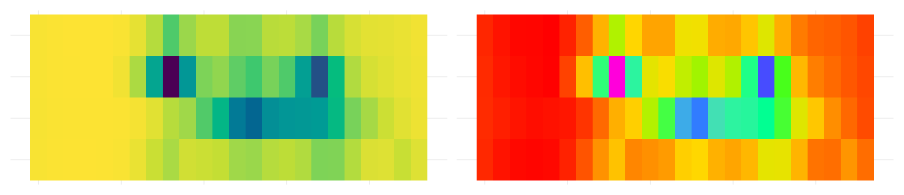

# Colour and emphasis {#sec-colour}



@sec-clutter was about taking things out. This chapter is about what's left,
and which part of it a reader meets first.

A plot where everything has equal weight has no first, second or third, so the
reader has to do the ranking themselves.

You're spending their attention whether you decide to or not.

::: {.overview}

## Overview {.unnumbered}

**Duration** 50 minutes

**Questions**

<!-- These map onto the sections below, in order. If you move a section, move its question. -->

- How do I get emphasis for free?
- How do I choose colours that every reader can tell apart?
- How do I make one group stand out against the others?

**What you need this session**

- A session of RStudio open
- Something to draw on, and something to draw with
- The following packages installed

```{r}
#| label: pkgs
#| message: false
#| output: false
library(tidyverse)
library(naniar)
library(colorspace)
library(gghighlight)
library(ggrepel)
library(patchwork)
```

```{r}
#| label: pkgs-extra
#| echo: false
#| output: false
library(countdown)
```

```{r}
#| label: ch7-data
#| message: false
pedestrian_hourly <- pedestrian |>
        mutate(day_type = if_else(
                condition = str_starts(week_day, "S"),
                true = "weekend",
                false = "weekday"
                )
        ) |>
        group_by(sensor_name, day_type, hour) |>
        summarise(
                mean_count = mean(hourly_counts, na.rm = TRUE),
                .groups = "drop"
        )

sensor_totals <- pedestrian |>
        group_by(sensor_name) |>
        summarise(total = sum(hourly_counts, na.rm = TRUE))
```

:::

## Order is free emphasis

> **The idea:** the order of your categories is a decision. If you don't make
> it, the alphabet makes it for you.

Our four sensors have been alphabetical since @sec-comparing.

```{r}
#| label: sensor-totals-print
sensor_totals |>
        arrange(desc(total))
```

Alphabetical order puts the third busiest first and the busiest second. The
letter B is doing work that traffic should be doing.

:::{.panel-tabset}

## alphabetical

```{r}
#| label: fig-alpha-order
#| fig-alt: |
#|   A bar chart of total foot traffic per sensor, in alphabetical order, so the
#|   bar lengths jump up and down with no pattern.
ggplot(sensor_totals,
       aes(x = total,
           y = sensor_name)) +
        geom_col()
```

## sorted

```{r}
#| label: fig-sorted
#| fig-alt: |
#|   The same bar chart sorted by total, so the bars form a clean descending
#|   staircase.
ggplot(sensor_totals,
       aes(x = total,
           y = fct_reorder(sensor_name, total))) +
        geom_col()
```

:::

One function, and the plot went from a lookup table to a ranking.

The same works on facets, so the panels read in order:

```{r}
#| label: fig-facet-sorted
#| fig-alt: |
#|   Four panels of hourly foot traffic, ordered from busiest sensor to
#|   quietest rather than alphabetically.
pedestrian_hourly |>
        mutate(sensor_name = fct_reorder(sensor_name, -mean_count, .fun = max)) |>
        ggplot(aes(x = hour,
                   y = mean_count,
                   colour = day_type)) +
        geom_line() +
        facet_wrap(vars(sensor_name))
```

Sorting is usually a good idea. Not always:

- **sort** when the reader is comparing
- **don't sort** when the reader is looking something up

A phone book sorted by height would be a nightmare.

::: {.callout-note title="Your Turn"}


::: {.callout-tip title="Setup code" collapse="true"}

```{r}
#| ref.label: ["pkgs", "ch7-data"]
#| eval: false
#| echo: true
```

:::
1. Add `fct_rev()` around the `fct_reorder()`. Which direction reads better for
   a horizontal bar chart?

2. Sort the facets by **weekend** traffic instead of overall traffic:

```{r}
#| eval: false
pedestrian_hourly |>
        filter(day_type == "___") |>
        mutate(sensor_name = fct_reorder(sensor_name, ___))
```

   Does the story change?

3. `fct_infreq()` sorts by how often a value appears. When would you want that
   instead of `fct_reorder()`?

```{r}
#| echo: false
#| eval: !expr knitr::is_html_output()
countdown(minutes = 5)
```

::: {.callout-tip title="Answer" collapse="true"}

Only open this if you've actually had a go.

**1.** `fct_rev()` puts the biggest at the top. For a horizontal bar chart I
prefer that, because English readers start top left and the most important bar
is the first thing they meet.

**2.** `filter(day_type == "weekend")` then `fct_reorder(sensor_name,
mean_count)`. The order changes: Birrarung Marr climbs, because a park is a
weekend place.

**3.** `fct_infreq()` counts rows, so use it when the thing you care about *is*
how often a category turns up. Bar charts of raw counts, mostly.

:::

:::

### Takeaways

- Alphabetical is not an order, it's the absence of one
- `fct_reorder()` on a variable your reader cares about is the cheapest
  emphasis available
- Sort for comparison, don't sort for lookup

## Colour that carries meaning

> **The idea:** colour is the channel most likely to fail silently. It can look
> fine to you and be unreadable to one reader in twelve.

Here's our four sensors in ggplot2's default colours.

```{r}
#| label: fig-default-cols
#| fig-alt: |
#|   Four hourly foot traffic lines, one per sensor, in ggplot2's default red,
#|   green, blue and purple.
p_sensors <- pedestrian_hourly |>
        filter(day_type == "weekday") |>
        ggplot(aes(x = hour,
                   y = mean_count,
                   colour = sensor_name)) +
        geom_line()

p_sensors
```

Note the `filter()`. `pedestrian_hourly` holds a weekday and a weekend row for
every hour, so colouring by sensor alone gives each line two values per hour and
it sawtooths, as in @sec-tidy. One kind of day is enough to talk about colour,
so keep those rows in their own object. Everything from here uses it:

```{r}
#| label: ch7-weekday
pedestrian_weekday <- pedestrian_hourly |>
        filter(day_type == "weekday")
```

Those four colours arrived for free, so it's worth looking at them properly.
`swatchplot()` from colorspace draws a palette as blocks of colour, and
`cvd = TRUE` adds a row for each kind of colour vision deficiency, plus a
desaturated row for anyone reading a black and white printout.

```{r}
#| label: fig-swatch-default
#| fig-height: 3
#| fig-alt: |
#|   The four default ggplot2 colours drawn as blocks, with rows underneath
#|   simulating deuteranopia, protanopia, tritanopia and desaturation.
swatchplot("ggplot2 default" = scales::hue_pal()(4), cvd = TRUE)
```

Read down a column to see what one colour turns into. Read across the
**Deuteranope** row, the commonest kind, and the first two blocks are both
olive and the last two are both blue. Four colours went in, two came out.

Side by side, with the legends off so it's just the lines:

```{r}
#| label: fig-cvd-sim
#| fig-height: 3.2
#| fig-alt: |
#|   Two copies of the four line plot next to each other. On the left the four
#|   lines are four colours. On the right, simulated for deuteranopia, they are
#|   two.
p_plain <- p_sensors + theme(legend.position = "none")

(p_plain + labs(title = "what you drew")) +
        (p_plain +
                scale_colour_manual(values = deutan(scales::hue_pal()(4))) +
                labs(title = "deuteranopia"))
```

That's `patchwork`, which puts two plots next to each other with `+`. Half the
information is gone. This is roughly 8% of men of northern European
descent, and about 0.5% of women.

**And the palette you were about to reach for has the same problem.** Dark2 is
the one everyone moves to next. Put the two of them next to viridis, in one
grid, and you can see which one survives:

```{r}
#| label: fig-swatch-compare
#| fig-height: 6.5
#| fig-alt: |
#|   Three blocks of swatches, one per palette, each showing the original
#|   colours and the same colours under three kinds of colour vision
#|   deficiency and desaturated.
swatchplot(
        "ggplot2 default" = scales::hue_pal()(4),
        "Dark2" = RColorBrewer::brewer.pal(4, "Dark2"),
        "viridis" = viridisLite::viridis(4),
        cvd = TRUE
)
```

- **ggplot2 default**: two olives and two blues
- **Dark2**: the first and fourth collapse to near identical greys
- **viridis**: four blocks you can still tell apart, in every row

The **Desaturated** row is the quickest test in the grid. Viridis survives it
because it varies **lightness** as well as hue: on a 0 to 100 lightness scale
its four colours span 76 points, where the ggplot2 default spans 6 and Dark2
spans 8.

A palette that survives a black and white photocopier will survive most eyes.

::: {.callout-tip title="Going deeper: seeing the lightness, and three tools that need a live session" collapse="true"}

"Varies lightness" isn't a matter of opinion, it's something you can plot.
`specplot()` pulls a palette apart into the three things a colour actually is:
**hue**, which colour it is; **chroma**, how saturated it is; and **luminance**,
how light it is.

```{r}
#| label: fig-spec-viridis
#| fig-height: 3
#| fig-alt: |
#|   An HCL spectrum plot of viridis. The luminance line climbs steadily from
#|   about 15 to about 95 across the palette.
specplot(viridisLite::viridis(100), main = "viridis")
```

```{r}
#| label: fig-spec-default
#| fig-height: 3
#| fig-alt: |
#|   An HCL spectrum plot of the ggplot2 default colours. The luminance line is
#|   flat at about 65 the whole way across, while hue climbs.
specplot(scales::hue_pal()(100), main = "ggplot2 default")
```

The blue luminance line is the whole argument. Viridis climbs from dark to
light in a near straight line, so the palette keeps an order even with the
colour taken away. The ggplot2 default sits flat at about 65 the whole way
across: every hue you like, all at the same brightness.

Three more from colorspace that want a live R session, so they aren't run here:

- **`hcl_wizard()`** opens a Shiny app for building a palette by dragging hue,
  chroma and luminance around, with the CVD simulations updating as you go, and
  hands you the hex codes at the end. It also lives at
  [hclwizard.org](https://hclwizard.org/) if you'd rather not run it locally.
- **`cvd_emulator()`** takes a jpg or png, a screenshot of a plot a colleague
  sent you, say, and re-renders it as protanope, deuteranope and desaturated.
  Useful when you can't get at the code.
- **`choose_color()`** is the same idea for a single colour, with sliders for
  hue, chroma and luminance.

:::

Our four lines again, in viridis:

```{r}
#| label: fig-viridis
#| fig-alt: |
#|   The same four lines in the viridis palette, which runs dark purple through
#|   green to yellow.
p_sensors + scale_colour_viridis_d()
```

### Match the palette to the variable

Most bad colour is a type mismatch. There are three kinds of palette, and each
one answers a different kind of question:

```{r}
#| label: fig-swatch-types
#| fig-height: 2.4
#| fig-alt: |
#|   Three rows of colour blocks. The qualitative row changes hue only, the
#|   sequential row runs dark purple to yellow, and the diverging row runs dark
#|   blue through near white to dark red.
swatchplot(
        Qualitative = qualitative_hcl(5, palette = "Dark 3"),
        Sequential = sequential_hcl(5, palette = "Viridis"),
        Diverging = diverging_hcl(5, palette = "Blue-Red 3")
)
```

- **qualitative** for unordered categories, like our four sensors. Hue changes,
  lightness stays put, so no category looks more important than another.
- **sequential** for magnitude, like a count. Lightness runs one way.
- **diverging** for distance from a midpoint, like above and below average. Two
  sequential palettes back to back, meeting at a neutral middle.

colorspace ships a ggplot2 scale for every combination of those, and the names
are built out of one rule:

`scale_<aesthetic>_<datatype>_<colourscale>()`

| piece | what goes there |
|---|---|
| aesthetic | `colour`, `color`, `fill` |
| datatype | `discrete`, `continuous`, `binned` |
| colourscale | `qualitative`, `sequential`, `diverging`, `divergingx` |

So `scale_fill_continuous_sequential()` is a fill, for a number, using a
sequential palette. That's 36 functions you never have to look up. Say what
you're colouring, what kind of variable it is, and what kind of palette you
want, and the name assembles itself.

The last two want a plot that can carry a magnitude, so here is the same
weekday data as tiles, one row per sensor and one column per hour:

```{r}
#| label: ch7-tiles
p_tiles <- ggplot(pedestrian_weekday,
                  aes(x = hour,
                      y = sensor_name,
                      fill = mean_count)) +
        geom_tile()
```

Same data, three questions, three palettes. And a fourth tab for what a
mismatch looks like.

:::{.panel-tabset}

## qualitative

```{r}
#| label: fig-pal-qual
#| fig-alt: |
#|   The four sensor lines in a qualitative palette, where the four hues are
#|   equally strong.
p_sensors + scale_colour_discrete_qualitative(palette = "Dark 3")
```

**Which sensor is this?** Nothing is ranked, so nothing shouts.

## sequential

```{r}
#| label: fig-pal-seq
#| fig-height: 3.2
#| fig-alt: |
#|   A tile plot of weekday foot traffic by hour and sensor, in viridis, where
#|   the busy hours are the dark tiles.
p_tiles + scale_fill_continuous_sequential(palette = "Viridis")
```

**How busy?** Dark is more and light is less, so the two commuter peaks at
Flagstaff Station show up without going to the legend.

## diverging

```{r}
#| label: fig-pal-div
#| fig-height: 3.2
#| fig-alt: |
#|   The same tile plot showing distance from each sensor's own average, in
#|   blue through white to red, with Flagstaff Station's 8am tile dark red.
pedestrian_weekday |>
        group_by(sensor_name) |>
        mutate(above_average = mean_count - mean(mean_count)) |>
        ggplot(aes(x = hour,
                   y = sensor_name,
                   fill = above_average)) +
        geom_tile() +
        scale_fill_continuous_diverging(palette = "Blue-Red 3")
```

**Busier or quieter than usual?** White is that sensor's own average, red is
above it, blue is below. The 8am and 5pm commute at Flagstaff Station is the
darkest thing on the plot.

## mismatched

```{r}
#| label: fig-pal-rainbow
#| fig-height: 3.2
#| fig-alt: |
#|   The same tile plot as the sequential tab, coloured with rainbow(), where
#|   the colours have no readable order.
p_tiles + scale_fill_gradientn(colours = rainbow(7))
```

The same magnitude as the sequential tab, in `rainbow()`. Is green more than
blue? You have to go back to the legend every time, because the colours have no
order of their own.

:::

::: {.callout-tip title="Going deeper: auditioning a palette with demoplot()" collapse="true"}

A swatch tells you the colours are different. It doesn't tell you how they
behave once they're spread over a real plot, in small pieces, sitting next to
each other. `demoplot()` paints a palette into a fake plot so you can judge that
before you go anywhere near your own data.

```{r}
#| label: fig-demoplot-types
#| fig-height: 2.6
#| fig-alt: |
#|   Three fake plots: a grouped bar chart in a qualitative palette, a contour
#|   heatmap in viridis, and a choropleth map in a blue to red diverging
#|   palette.
par(mfrow = c(1, 3), mar = c(1, 1, 3, 1))

demoplot(qualitative_hcl(5, palette = "Dark 3"), type = "bar")
title("qualitative / bar")

demoplot(sequential_hcl(5, palette = "Viridis"), type = "heatmap")
title("sequential / heatmap")

demoplot(diverging_hcl(5, palette = "Blue-Red 3"), type = "map")
title("diverging / map")
```

There are nine types to choose from: `"map"`, `"heatmap"`, `"scatter"`,
`"spine"`, `"bar"`, `"pie"`, `"perspective"`, `"mosaic"` and `"lines"`. Pick
whichever is closest to the plot you're actually making.

It pairs with the simulators. Put the palette through `deutan()` or
`desaturate()` first, and demoplot draws what that reader gets:

```{r}
#| label: fig-demoplot-cvd
#| fig-height: 2.6
#| fig-alt: |
#|   The same choropleth map three times: in a four colour qualitative palette,
#|   simulated for deuteranopia where two of the colours drift together, and
#|   desaturated where the whole map is one grey.
pal <- qualitative_hcl(4, palette = "Dark 3")

par(mfrow = c(1, 3), mar = c(1, 1, 3, 1))

demoplot(pal, type = "map")
title("original")

demoplot(deutan(pal), type = "map")
title("deuteranope")

demoplot(desaturate(pal), type = "map")
title("desaturated")
```

Under deuteranopia the pink and the teal both drift towards grey, and
desaturated the map is one colour. That is what a qualitative palette *is*: hue
does all the work. These four colours span 4 points of lightness, against
viridis's 76, so there's nothing left to fall back on.

Which is the argument for the next section. If a reader might print your plot in
black and white, or you have more than a handful of categories, you're better
off highlighting one series than colouring all of them.

:::

::: {.callout-tip title="Read more"}

More on checking a palette before you commit to it, in [Quickly Assessing
Colour Palettes](https://www.njtierney.com/posts/2020-10-15-assess-colour/).

`prismatic::check_color_blindness()` is the same idea as
`swatchplot(cvd = TRUE)`, from a different package, if you'd rather one call
than two arguments.

I gave a talk at Monash Data Fluency on how colour vision actually works and
what follows from it for graphics: [The Use of Colour in
Graphics](https://github.com/njtierney/monash-colour-in-graphics), slides and
resources.

And if you want to know where viridis came from, the talk that produced it is
[A Better Default Colormap for
Matplotlib](https://www.youtube.com/watch?v=xAoljeRJ3lU) by Nathaniel Smith and
Stéfan van der Walt, SciPy 2015. Half an hour, and you'll never look at a
rainbow scale the same way.

:::

::: {.callout-tip title="Going deeper: hour is cyclic" collapse="true"}

`hour` is none of the three types. Midnight is next to 23:00, so a sequential
palette puts the two closest hours at opposite ends of the scale.

There's no good default for this. The three way taxonomy is useful and it isn't
the whole story.

:::

::: {.callout-note title="Your Turn"}


::: {.callout-tip title="Setup code" collapse="true"}

```{r}
#| ref.label: ["pkgs", "ch7-data", "ch7-weekday", "ch7-tiles"]
#| eval: false
#| echo: true
```

:::
1. Put a palette you use at work through `swatchplot(cvd = TRUE)`. Does it
   survive the **Deuteranope** row? Does it survive the **Desaturated** one?

2. Compare two more brewer palettes in one grid:

```{r}
#| eval: false
swatchplot(
        "Set1" = RColorBrewer::brewer.pal(4, "___"),
        "Set2" = RColorBrewer::brewer.pal(4, "___"),
        cvd = TRUE
)
```

   Better or worse than Dark2?

3. Colour `p_tiles` by `mean_count` with a qualitative palette,
   `scale_fill_discrete_qualitative()`. **You should get an error.** What is
   ggplot2 telling you about the variable?

```{r}
#| echo: false
#| eval: !expr knitr::is_html_output()
countdown(minutes = 5)
```

::: {.callout-tip title="Answer" collapse="true"}

Only open this if you've actually had a go.

**2.** Set1 holds up better than Dark2, because its colours differ in lightness
as well as hue: they span 19 points of lightness against Dark2's 8. Set2 is
pastel, spans 6, and collapses badly.

**3.** `Error: Continuous value supplied to a discrete scale.` A discrete scale
wants a discrete variable, and `mean_count` is a number. This is the one type
mismatch ggplot2 catches for you. It has nothing to say about `rainbow()`.

:::

:::

### Takeaways

- The default palette fails under colour vision deficiency, and so does Dark2
- Palettes that vary lightness survive, which is why viridis is the safe default
- Look at a palette with `swatchplot(cvd = TRUE)` rather than guessing from hex
  codes
- Qualitative for categories, sequential for magnitude, diverging for distance
  from a midpoint

## Emphasis by contrast

> **The idea:** four colours asks the reader to rank four things. Usually you
> want them to look at one.

Grey is not an absence of colour. It's a demotion, and you do it on purpose.

```{r}
#| label: fig-demote
#| fig-alt: |
#|   Four hourly lines, three in pale grey and one, Flagstaff Station, in dark
#|   red.
ggplot(pedestrian_weekday,
       aes(x = hour,
           y = mean_count,
           group = sensor_name)) +
        geom_line(colour = "grey80") +
        geom_line(data = filter(pedestrian_weekday,
                                sensor_name == "Flagstaff Station"),
                  colour = "firebrick")
```

Two `geom_line()` calls, one of them filtered. `gghighlight()` from
@sec-clutter does the same job in one line, and it's worth having seen the
manual version so it isn't magic.

Then get rid of the legend by putting the label on the line.

```{r}
#| label: fig-direct-label
#| warning: false
#| fig-alt: |
#|   The four sensor lines with each name printed at the right hand end of its
#|   own line, and no legend.
sensor_labels <- pedestrian_hourly |>
        filter(day_type == "weekday") |>
        group_by(sensor_name) |>
        slice_max(hour, n = 1)

p_sensors +
        geom_text_repel(data = sensor_labels,
                        aes(label = sensor_name),
                        hjust = 0,
                        direction = "y",
                        nudge_x = 1) +
        theme(legend.position = "none") +
        coord_cartesian(xlim = c(0, 32))
```

A legend makes the eye bounce between the key and the plot, once per series. A
label sits where the thing is.

::: {.callout-note title="Your Turn"}


::: {.callout-tip title="Setup code" collapse="true"}

```{r}
#| ref.label: ["pkgs", "ch7-data", "ch7-weekday", "fig-demote"]
#| eval: false
#| echo: true
```

:::
1. Put the two colours in the greyed plot through the simulator:

```{r}
#| eval: false
swatchplot(c("grey80", "firebrick"), cvd = TRUE)
```

   Does the contrast survive better than four categorical hues did?

2. Highlight a different sensor:

```{r}
#| eval: false
ggplot(pedestrian_weekday,
       aes(x = hour, y = mean_count, colour = sensor_name)) +
        geom_line() +
        gghighlight(sensor_name == "___")
```

   gghighlight warns about a `group_by()` calculation falling back. The plot is
   fine.

3. If the question were "where is busy on a weekend", which sensor would you
   highlight? Is that the same answer you gave in @sec-comparing?

```{r}
#| echo: false
#| eval: !expr knitr::is_html_output()
countdown(minutes = 5)
```

::: {.callout-tip title="Answer" collapse="true"}

Only open this if you've actually had a go.

**1.** Yes. Every row keeps a pale block and a dark one, the desaturated row
included, because grey against one colour is a lightness difference and
lightness is what survives. This is the strongest argument there is for
highlighting one series over colouring four.

**3.** Birrarung Marr, because it's the only sensor where the weekend beats the
weekday. Same answer as @sec-comparing, which is a good sign: the emphasis
should follow the finding, not replace it.

:::

:::

### Takeaways

- Grey is a decision, not a default
- Highlight one series rather than colouring four
- A direct label beats a legend, because the reader stops travelling

::: {.callout-tip title="Polish" collapse="true"}

The highlight told the reader where to look. It did not tell them what they were
looking at.

```{r}
#| label: fig-polish
#| warning: false
#| fig-alt: |
#|   The greyed line plot with Flagstaff Station in red, a point on its 8am peak
#|   and a label naming it.
peak <- pedestrian_weekday |>
        filter(sensor_name == "Flagstaff Station") |>
        slice_max(mean_count, n = 1)

ggplot(pedestrian_weekday,
       aes(x = hour,
           y = mean_count,
           group = sensor_name)) +
        geom_line(colour = "grey80") +
        geom_line(data = filter(pedestrian_weekday,
                                sensor_name == "Flagstaff Station"),
                  colour = "firebrick") +
        geom_point(data = peak, colour = "firebrick", size = 2) +
        geom_text_repel(data = peak,
                        aes(label = "Flagstaff, 8am"),
                        nudge_y = 400,
                        colour = "firebrick") +
        scale_y_continuous(labels = scales::label_comma()) +
        labs(x = "Hour", y = NULL) +
        theme_minimal()
```

- **Annotate the one point you are talking about.** A highlighted line says
  "this one". A label says why.
- **Match the annotation colour to the thing.** The label is the same red as the
  line, so nothing has to be traced.
- **Drop the y title.** `mean_count` was never doing any work, and the comma
  formatted numbers say what they are.

:::

## To summarise

Three things to take out of this chapter.

1. **Order is free emphasis.** `fct_reorder()` costs one function and turns a
   lookup table into a ranking.
2. **Colour fails silently.** Look at it with `swatchplot(cvd = TRUE)`, prefer
   palettes that vary lightness, and match the kind of palette to the kind of
   variable.
3. **Grey is a decision.** Highlight the one series you're talking about, demote
   the rest, and put the label on the line rather than in a legend.

And the habit: before you style anything, decide what you want the reader to see
first. Then make that the loudest thing on the page and demote everything else.

Next up is the last mile: labels, themes, and getting a file out that looks
the way it did on your screen.
